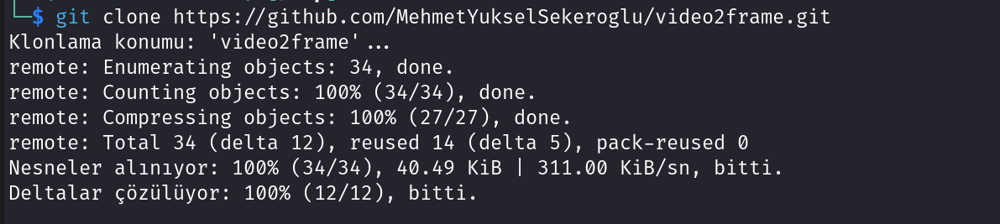
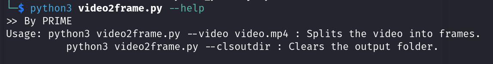
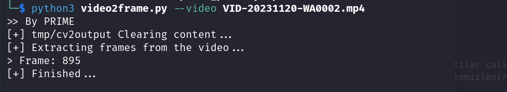
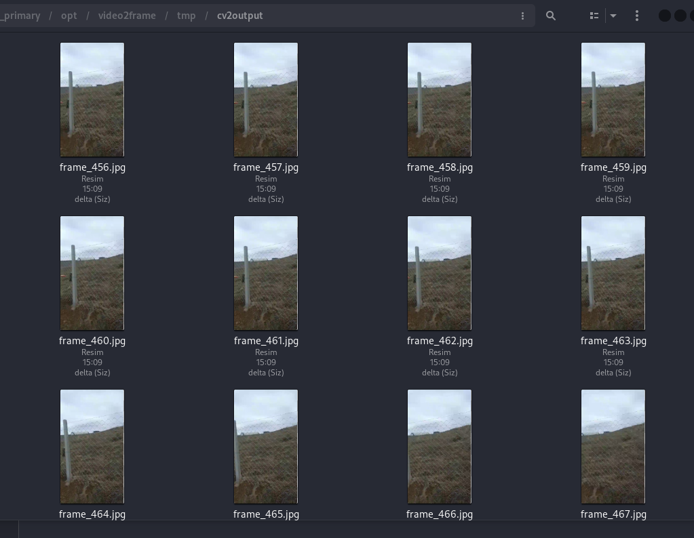

<p>

# Videoların karelerine ayrılması

<br>
Bir videoyu incelerken ayrıntıları incelemek zordur bu nedenle videoyu karelerine ayırıp tek tek bakmak genel olarak daha kolaydır bu nedenle bu derste bunu görecez. Bu işlem için başkar araçlar vardır ama ben kendi yazdığım basit bir python3 aracı kullanacam haydi başlayalım.

<br>

```shell
# Repomuzu çekmek için git aracı
sudo apt install git -y

# öncelikle python3 ü kuralım 
sudo apt install python3 -y

# python3 için opencv paketini kuralım pip ile kurulabilir ama kali linux 
# içerisinde depodan kurmak gerekmektedir 
sudo apt install python3-opencv -y

# ubuntu sistemler için ek olarak pip paketini kuralım 
sudo apt install python3-pip -y
```


<br>

Şidmi aracımızı GitHub üzerinden çekebiliriz. [Repo Adresi](https://github.com/MehmetYukselSekeroglu/video2frame)

<br>

```shell
# Rpoyu çekelim 
git clone https://github.com/MehmetYukselSekeroglu/video2frame.git

# içerisinde girelim
cd video2frame
```

<br>


<br>

Şimdi `python3 video2frame.py --help` çalıştıralım ve yardım menüsüne bakalım.


<br>

<br>

Görüldüğü gibi 2 seçenek var sadece ilki video ikincisi çıktı temizleme için çıktılar çalışma klasörü altında tmp/cv2output altındadır her video ayıklaması sırasında içeriği temizlenir ama elle temizleme seçeneğide vardır.

<br>

```shell
python3 video2frame.py --video /home/user/my_video.mp4
```

<br>


<br>

Bilgi ekranımız geldi ve ayıkladı ayıklanan kareleri sırası ile ekrana durumu yazar. Şunu unutmamak lazım video çok uzun ise one görede boyut çıkacaktır.

<br>



<br>

Basit ama gerekli bir konuydu bence bu derslik bu kadar.

</p>
