<div align="center">
    
</div>

# BurpSuite kurulumu ve ayarlanması

<br>
<p>Bugünkü konumuda web testlerinin olmazsa olmazlarından olan BurpSuite'in kurulumu ve kullanılması için temel yapılandırılması olacaktır.

<h3>BurpSuite Nedir?</h3>
BurpSuite web sitelerine gönderdiğimiz istekleri yakalamamızı tekrar düzenlememizi, analiz etmemizi veya otomatize etmemizi sağlayan Java dili ile yazılmış Profesyonel ve Topluluk lisansı bulunan bir araçtır. Burp sadece web alanında değil mobil uygulamaların testi esnasında vs de kullanılabilmektedir ama bütün bu işlemleri yapabilmesi için önce tarfiği şifresiz olarak görebilmesi gerekiyor (Önceki derslerimizdeki SSL kısmına bakabilirsiniz) bunun içinde Proxy ve kendisine özel bir SSL sertifikası kullanmaktadır. Bu sertifika sayesinde web sitelerine giden gelen trafiği şifresiz olarak görebilmekte ve proxy özelliği ile durdurup düzenlememizi veya ne yapacaksak yapmamızı sağlar. Şimdir kuruluma geçerlim.
</p>


<br>

## Kurulum

### İlk olarak herzamanki gibi sistemimizi update & upgrade etmekte
```shell
# Kali Linux'da update işlemi bittikten sonra kendisi çıkmayabilir CTRL+C ile çıkabilirsiniz işlem bitince
sudo apt update 

# Tüm sistemi güncelleyelim (opsiyonel)
sudo apt full-upgrade
```


### Resmi siteden BurpSuite'i indirelim 
`https://portswigger.net/burp/releases/professional-community-2023-11-1-5?requestededition=community&requestedplatform=` adresine girerek buradan Community edition'u seçerek istediğiniz platforma göre indirebilirsiniz.


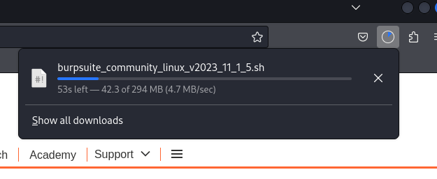
<br>

### Installer dosyasını çalıştıralım 
Sizde farklı bir isimde olabilir o nedenle dosya adına ve indiği konuma dikkat edin `bash burpsuite_community_linux_v2023_11_1_5.sh` NOT: eğer komut satırından açabilmek istiyorsanız komutun başına `sudo` koymayı unutmayın çünkü kendisini sistem path ine eklemesi için yetki gerekecek. Şimdi sırasıyla gelen ekranlara bakalım.

<br>

### Installeri çalıştırdıktan sonra
<p>Sizi direk olarak böyle bir grafiksel kurulum ekranı karşılıyor haydi başlayalım.

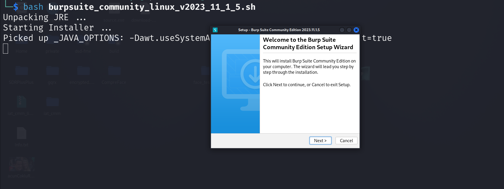
<br>
<br>

Şimdi bize nereye kurmak istediğimizi soracaktır bunu düzenlemeye gerek yok ön tanımlı olarak başlatsın.

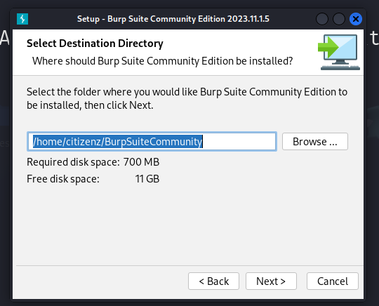
<br>
<br>

Şimdide komut satırından kullanabilmemiz için kendisini `PATH` altına eklensinmi diye soruyor ön tanımlı seçilidir bu ama installer scripti çalıştırırken başına `sudo` koymadıysanız eklenmicektir malum yetkisi yok :)

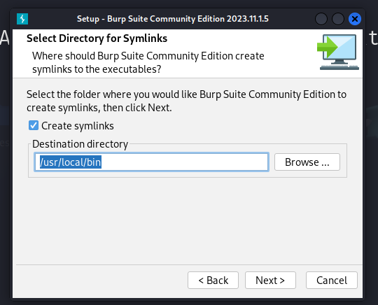
<br>
<br>

Seçimlerimi yaptıktan sonra gerekli dosyaları çıkartmaya başlıyor.

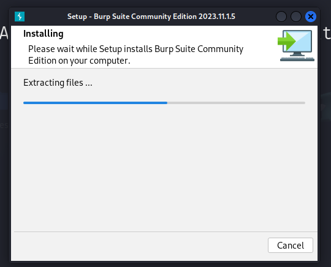
<br>
<br>

İşlem bittikten sonra altaki gibi bir ekran gelir finish dedikten sonra BurpSuite kullanıma hazır olacaktır.

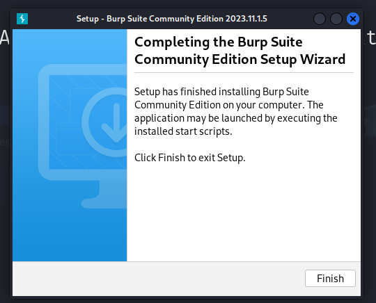
<br>
<br>

Şimdi kali menü üzerinden `BurpSuite` yazarak ulaşabilirşiz `PATH` altına eklenmese bile buraya otomatik eklenir bunun için `sudo` yetkisine gerek yoktur.

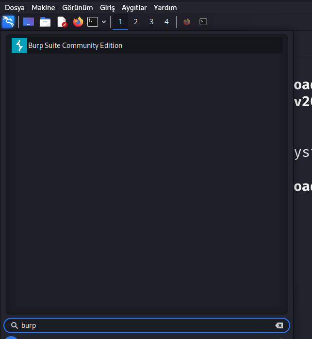
<br>
<br>

Seçip başlattıktan sonra ilk başlatmaya özel olarak lisans sözleşmesi gelir seve seve kabul ediyoruz bunuda.

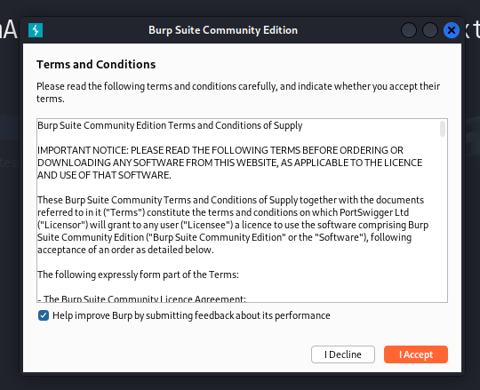
<br>
<br>

Şimdi BurpSuite'in herzaman göreceğiniz başlangıç ekranına geldik burada çalışma alanı oluşturma veya varolanı seçme hakkı var ama profesyonel lisans için onlar biz direk empty ile devam edecez.

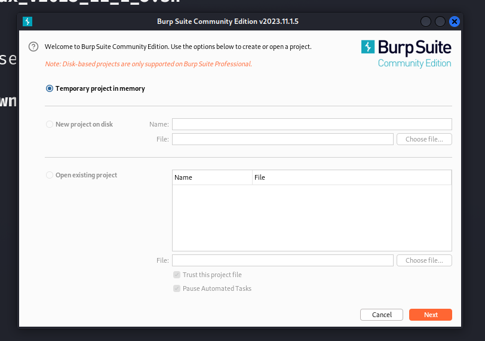
<br>
<br>

Bizi karşılayan ekran ilk başlatma için öğretici menü olacak aşşağıdaki gibi burada kurulum işlemi tamamlanmış oldu, artık proxy kurulumu ve sertifika verme işlemine geçebiliriz.


## Ayarlanması

Ayarlama esnasında ben FireFox kullanacam ama diğer tarayıcılardada aynı şekilde kurulacaktır gerekli şeyler haydi devam edek.

### Proxy yi kontrol etmek için FoxyProxy eklentisini kuralım


UYARI: BurpSuite'in çalışıyor olması gerekiyor gerekli ayarları yapabilmek için.
Firefox tarayıcımızı açalım ve eklenti yöneticisine girelim eğer eklentiler kısmını bulamadıysanız URL kısmına `about:addons` yazarak ulaşabilirsiniz. 

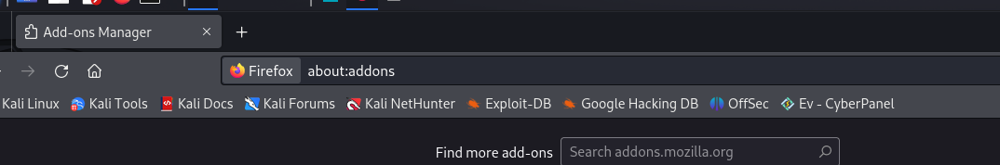
<br>
<br>

Buradan FoxyProxy eklentisini aratalım farklı eklentilerde olur ama arayüzü göz yormuyor ben seviyorum o yüzden. FoxyProxy'nin orjinali yanında `Recommended` şeklinde bir yazı bulundurur buna girelim ve FireFox a ekle diyelim. Gizli sekmede vs çalışsınmı diye soracaktır o size kalmış.

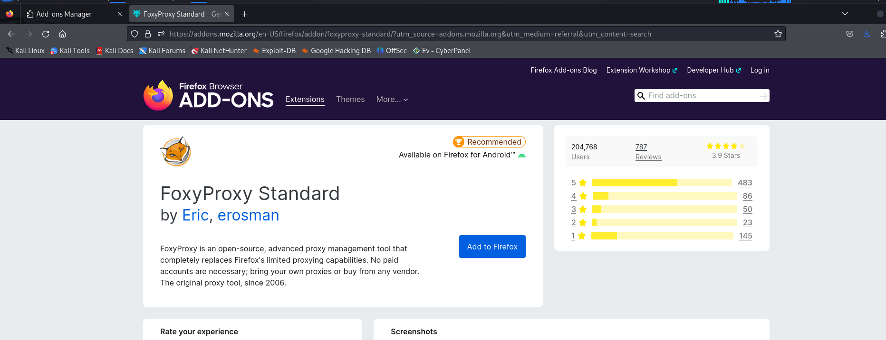
<br>
<br>

Eklentilerden FoxyProxy'i seçelim 

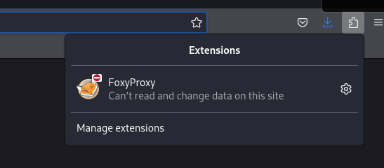
<br>
<br>

Buradan `Options` kısmına girelim

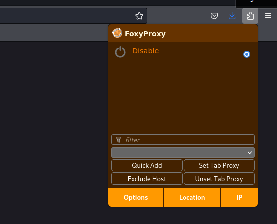
<br>
<br>

Bu kısımdan `Proxies > Add` kısmına tıklayalım orada böyle boş bir proxy şeması gelecek

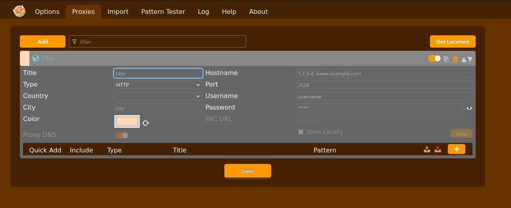
<br>
<br>

Gerekli ayarları girdikten sonra altdaki gibi olacaktır ayarları ve amaçlarını açıklayalım. IP kısmına `127.0.0.1` girme sebebimiz çalıştığımız bilgisyarı belirtir trafiği kendi bilgisyarımıza verecez yani, Port kısmına ise BurpSuite'in Proxy olarak dinleme yaptığı `8080` portunu veriyoruz, Proxy tipi olarak `HTTP` seçiyoruz.


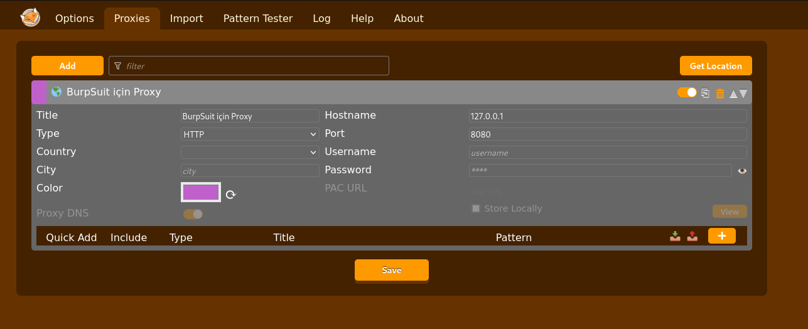
<br>
<br>

Kaydedip çıkalım şimdi proxyler kısmından tekrar BurpSuite için yaptığımız proxyyi seçelim.

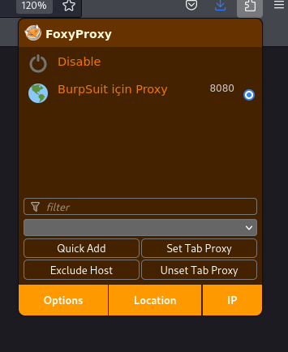
<br>
<br>

Peki bitti sertifika eklemeden kullanmak istiyoruz diyelim ne olabilir en fazla? Aşşağıya bakarsanız anlarsınız.

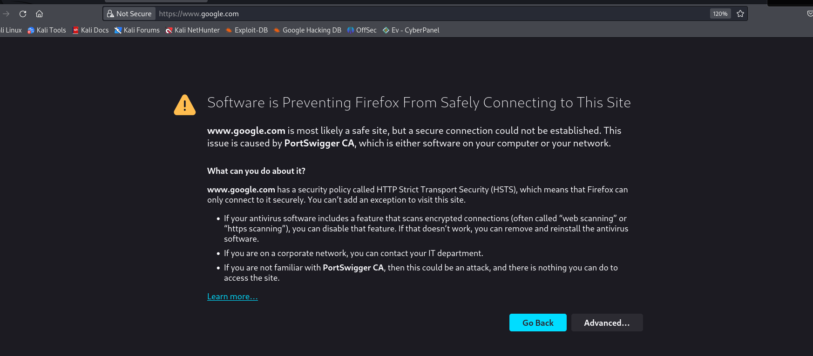

<br>
<br>

Görüldüğü gibi sertifika olmazsa trafiğin izlendiğini ve bu nedenle sürekli bu uyarıyı göreceksiniz diyor bunu engellemek için şimdi gerekli ssl sertifikamızı kuralım. Bunun için URL kısmına `http://burp` yazalım bizi bir sayfaya atacak ve sertifika indirmemizi isticek download diyerek indirelim bu sertifikayı. `CA Certificate` yazısına tıklarsanız indirecektir.

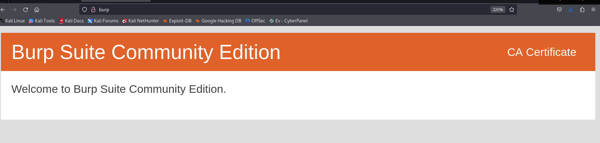

<br>
<br>

İndirdiyseniz şimdi firefox ayarlarından Türkçe ise `sertifika` ingilizce ise `certificate` şeklinde arama yaparak yüklü sertifikalarımızı görelim.

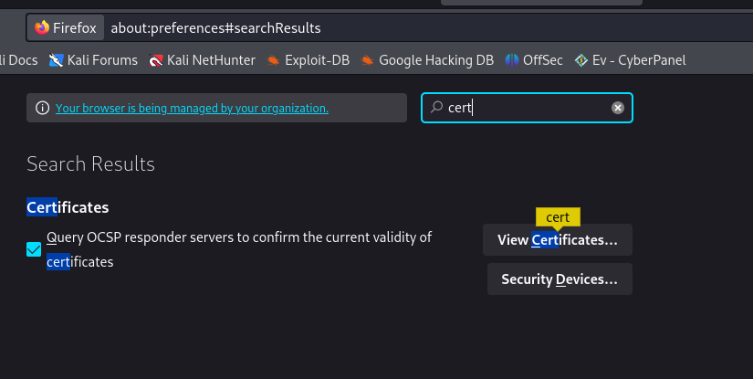


Girdiğimiz zamana `Authorities` yani güvenilir kurum ve sertifikaları içeren bir sekme olacak oraya girelim.

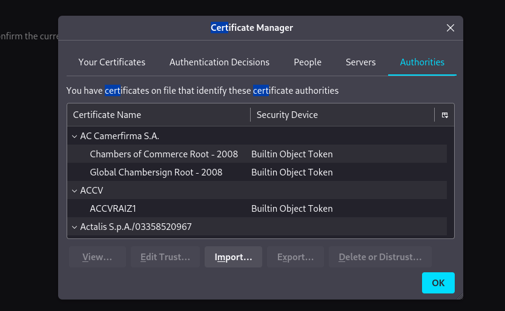
<br>
<br>

import diyerekden demin indirdiğimiz BurpSuite sertifikasını içe aktarmaya başlayalım bu dosya genelde `carter.der` adında iner. İçer aktarırken aşşağıdaki gibi bir ekran gelecek.

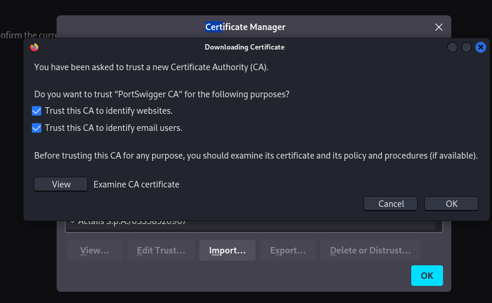
<br>
<br>

Buradaki 2 kutucuğuda işaretlememiz gerekiyor ki sertifikaya güvensin ve sürekli SSL izleniyor hatası vermesin sonrasında `ok` butonuna basarak tamamlayabiliriz işlemi. Eğer doğru şekilde kurulduysa güvenilir sertifikalar arasında PortSwigger altında görünecektir. Örnek olarak altdaki resme bakabilirsiniz.

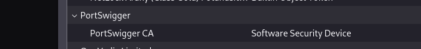
<br>
<br>


Evet işlem tamamdır artık rahatlıkla BurpSuite'i kullanabilirsiniz bu derslik bu kadar dostlar eğitim videosu yakın zamanda çekilecektir.


<br>
<br>


</p>
