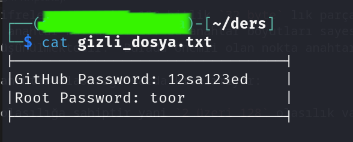
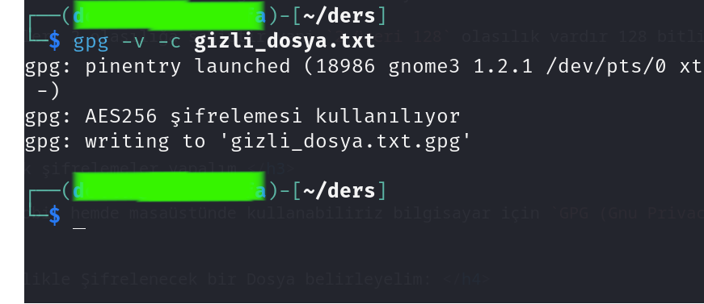
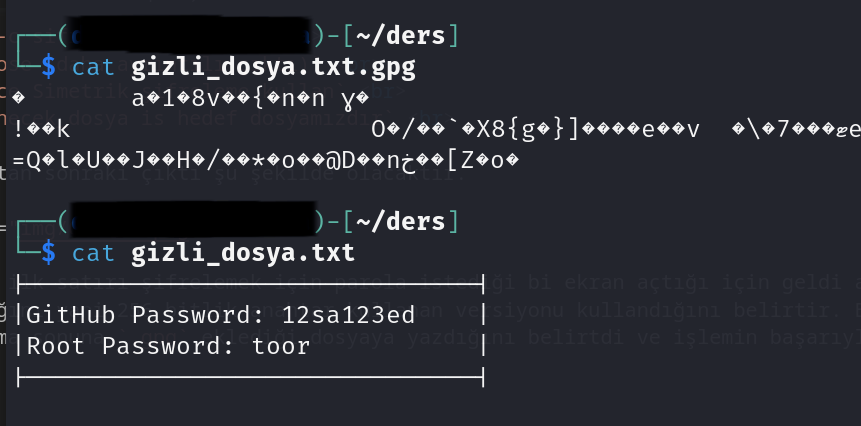
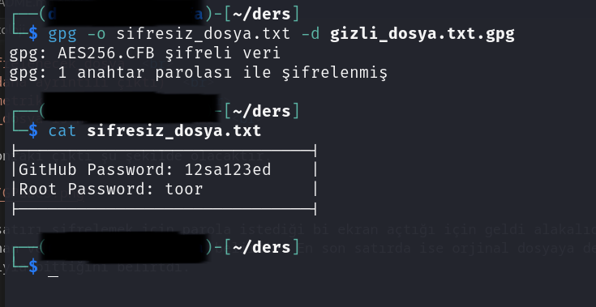

# Kriptoloji

<h1>Kriptoloji nedir?:</h1>

<p>

Kriptoloji şifreleme ve şifre çözme yöntemlerini inceler bunun yanı sıra veri bütünlüğü, gizlilik ve kimlik doğrulama amaçlarında kullanılmaktadır bunları yaparken yoğun matematiksel işlemler kullanılmaktadır bu nedenle kriptolojinin temeli matematik denebilir.

Tarihten günümüze kadar doğru veya yanlış başarılı veya başarısız pek çok yöntem kullanılmıştır bu alanlarda. Bunlara örnek olarak (sezar kodlaması, Almanların ünlü enigmesı vs.)


</p>

<br>

<h1>Kriptolojinin Genel Tarihi:</h1>

<p>
Genel olarak kriptoloji MÖ.4000 lerde mısır eserlerinde vs rastlansada ilklerden olan sezar şifrelemesi daha yaygın bilinir buda MÖ.50 yıllarında romada bulunmuştur ismini o günkü roma imparatorundan alır bu şifreleme aslında şifreleme denemez bir encoding dir 
belirli bir orana göre her her harf o oranda yer değiştirir ve bu sayede metin okunmaz günümüzdeki base64 ün daha ilkel hali denebilir yani. Mesela 5 seçilirse her harf alfabedeki 5 sıra sonrasındaki harf olarak yazılır bu mantıkla çalışmaktadır. Bu noktadan sonra zamanla farklı şifrelemeler vs gelişiyor.


<br>
<br>
<br>
<br>


Diğer en bilindik metotlardan biriside almanların ünlü enigmesıdır. Kelime anlamı anlaması zor birşey şeklindedir elektromekanik bir şifreleme sistemidir 2.Dünya savaşının ilk yıllarında oldukça başarılı olsada Birleşik Kırallık kod ve şifre çözme okulundan `Alan Turing` ve `Thomas Harold Flowers` yardımıyla kırışmıştır kırılması için yapılan çalışmalar sonucunda Alan Turing günümüz bilgisayarlarının temelini atmıştır Thomas Harold ise ilk dijital ve programlanabilir bilgisayarını geliştirmiştir. Peki enigmanın bukadar uzun uğraşlar sonucunda kırılmasının sebebi nedir enigma girilen her harfi anahtara göre rastgele olarak başka bir harfle eşleştiren bir yapısı vardı bu sayede insanlar için çözülemez görünmekteydi bu işlemdeki anahtar ise en fazla 12 olmak üzere kullanılan çift yönlü kablolardı en verimli hali 11 kablo kullanımında yaklaşık 200 trilyon kombinasyon oluşuyordu.


</p>


<br>


<h1>Günümüzde Durumlar Nedir: </h1>

<p> Günümüzde artık teknolohjinin hayattakı konumu nedeniyle kriptolojinin değeri artı sms mesajlardan yayınlara, bulut depolamadan askeri teknolojilere bi stadnart olmuştur.


Günümüzde `şifreleme` ,`encoding (kodlama)`, `hashing (karma hesaplama)` ve `salting (tuzlama)` olmak üzere 4 yapı bulunmaktadır bunları tek tek incelicez ve sonuç olarak bu konulardaki saldırıları incelicez ve kendimiz deneyimlicez.


<br>
<h1>Bit ve btye kavramları:</h1>

Bit bilgisayar sistemlerinin en temeli olan 1 ve 0 lardır. Tüm bilgisayar altyapısı buna bağlıdır BYTE ise 8 tane bit in yan yana gelerek bizim anlicamız karakterleri temsil etmesidir.

`K -> 01001011`

Büyük K harfinin bit karşılığı mesela. Peki dönüştürmeler nasıl oluyor dersek:

8 adet bit 1 byte olduğu için direk bölebiliriz.

`128 / 8 = 16 byte`


<br>

<h1>Anahtar ile Parola farkı</h1>
Şifreleme kısmına girmeden önce en önemli noktalardan birisi olan anahtar parola farkına bakalım.

Parolalar insanların akıllarında tutabileceği belirli uzunluklardaki kelimeleridir 
kimlik doğrulama vs sistemlerinde kullanılır ama anahtar ise rastgele olarak oluşturulmuş şifrelemede kullanılan karakter dizileridir ve sadece `A-Z ve 0-9` arası olabilirler belirli uzunluk standartları vardır.

<br>

Mesela en basit olarak 128 bitlik bir anahtar demek 16 karakterlik bi veridir.

`128 bit: 35a0df382927b9c44ed5a6b71587996d`

`192 bit: 8fae34672bd01c3e5f27984c6d5a7b9e9a281bdf26e7307f`

`256 bit: 6d28a40b917c3f5e259da7cb3e841fac8b621c3d590a874e623908be14a3f67d`

Şeklindiedir peki biz disk vs şifrelerken parola giriyoruz nasıl kabul ediyor dersek.
Parolalar belirli işlemlerden geçerek anahtara dönüştürülebilir bunlara en basit örnek dersin ilerisinde göreceğimiz `hashing (karma)` işlemidir. 

`Parolamız: TheKoba-dev -> sha256 -> 28c8936105f386ab5045b1a5d3e48eeccd074c15a8d58a128ccb686a94207f89`

Yukarıdaki şekilde parolamızı sha256 algoritması ile 256 bitlik bir anahtara çevirdik.


<h1>Şifreleme (Encryption)</h1>
Şifreleme ve şifre çözme olarak iki adımlı olarak gerçekleşmektedir bu işlem ve farklı metot ve algoritmaları vardır.

Bu Yöntemler:
- Simetrik şifreleme 
    - AES 
    - DES

- Asimetrik şifreleme 
    - RSA
    - DSA


Yukarıdaki gibi iki gruba ayrılırlar bunları sırası ile inceleyelim.


<h1>Simetrik Şifreleme:</h1>

Simetrik şifreleme işleminde şifreleme ve şifre çözme işlemlerinde aynı anahtar kullanılır buna gizli anahtar denmektedir simetrik şifrelemede veriler blok blok işlenir 
avantajlı noktaları şifreleme ve çözme anahtarı aynı olması sayesinde daha az hesaplama gerektirir şifreleme ve çözme işlemi daha hızlı gerçekleşir günümüzde pek çok alanda kullanılır en bilindiği `Advanced Encryprion Standart` AES dir ağ güvenliğinden veri tabanı güvenliği gibi çoğu alanda kullanılmaktadır.


Bu algoritmaların dez avantajları ise

- Anahtar yönetimi 
- Anahtar sayısı 
- İletişim sorunları 


<br>
<h2>Anahtar yönetimi ve sayısı</h2>

Simetrik şifreleme algoritmalarında şifreleme ve çözme için aynı anahtar kullanılır demiştir buda herkes için 1 adet anahtar olması demektir anahtarın doğru kişilere teslim edilmemesi güvenlik sorunlarına neden olacaktır.


<br>
<h2>İletişim sorunları</h2>

İşlemler için gizli anahtarın iki taraftada bulunması gerekiyor 
bu nedenle anahtarın iletilmesi için güvenli bir kanal olması gerekmektedir anahtarın 3.kişilerin eline geçmesi tehlikelidir.


<br>
<h2>AES (Advanced Enctypion Standart)</h2>

Gelişmiş şifreleme standardı olan `AES` 1997 yılında abd da DES in yetersiz kalması sonucunda geliştirilmiş bi blok şifreleme algoritmasıdır şifrelenecek veriyi 128 bitlik `32 byte` lık parçalara bölerek işler ve şifreleme için sürümlerine bağlı olarak 128, 192 veya 256 bit anahtar kullanabilir. Bu anahtar boyutları sayesinde aes birkaç yüzyıl daha kaba kuvvet saldırılarına dayanabileceği düşünülmektedir.  Burada önemli olan nokta anahtar ile parolanın karıştırılmamasıdır. 

Peki aes in kaç anahtar olasılığı varda kırılımıyor:

Bit değerleri 2 olasılığa sahiptir yani `2 üzeri 128` olasılık vardır 128 bitlik anahtarlar için.


<h3> Örnek şifrelemeler yapalım </h3>

AES hem nobil hemde masaüstünde kullanabiliriz bilgisayar için `GPG (Gnu Privacy Guard)` aracını kullanacaz.
<br>

<h4> Öncelikle Şifrelenecek bir Dosya belirleyelim: </h4>


Resimdeki gibi çok çok gizli bir dosya ayarladım şimdi gpg ile şifreleme yapalım.




Şimdi şu komutumuz ile şifreleme yapalım hemmen.

`gpg -v -c sifrelenecek_dosya` <br>
`-v Verbose (daha ayrıntılı çıktı)` <br>
`-c Sadece Simetrik şifreleme kullan` <br>
`sifrelenecek_dosya is hedef dosyamızdır` <br>

Bu komuttan sonraki çıktı şu şekilde olacaktır.



Çıktının ilk satırı şifrelemek için parola istediği bi ekran açtığı için geldi alakalıdır sonrasına bakacak olursak bize `aes256` kullandığını yani 256 bitlik anahtar kullanan versiyonu kullandığını belirtir. En son satırda ise orjinal dosyaya değilde aynı isimde ama sonuna `.gpg` eklediği dosyaya yazdığını belirtdi ve işlemin başarıyla bittiğini belirtdi.

``` bash

TheKoba-dev@Safaksiz-$ file gizli_dosya.txt.gpg 
# Çıktı: gizli_dosya.txt.gpg: GPG symmetrically encrypted data (AES256 cipher)    

```


Linux üzerindeki `file` komutumuz ile şifrelenmiş dosyamızın tipine baktık ve bize GPG simetrik şifreleme ile şifrelenmiş veri ve aes256 kullanıldığını belirtiyor, dosyamızı okumaya çalışalım birde.



Görüldüğü gibi içerik okunamıyor bunun dosya uzantısı ile alakası yoktur o sadece kullanıcı tarafından anlaşılması için eklenir bu dosya artık ilgili parola veya anahtar olmadan açılamicaktır.


<h3> Örnek şifrelemeyi çözelim</h3>





Komutumuz şu şekildedir `gpg -o cıktı_dosyası.txt -d sifreli_dosya.txt.gpg` buradaki `-o cıktı_dosyası` kısmını ekleme sebebimiz gpg nin şifresi çözülen veriyi direk ekrana yazmasıdır bu nedenle program veya resim şifrelemiş isek sorun olmasın diye dosyaya yazacağız `-d sifreli_dosya.txt.gpg` de şifresi çözülecek dosyadır doğru parola verildikten sonra ver çözülerek dosyaya yazıldı ve okunur hale geldi.


<br>


<h1>Asimetrik Şifreleme:</h1>

Asimetrik şifreleme'nin çalışma mantığı temelde iki anahtarın kullanılmasıyla gene matematiğe dayanmaktadır. Bu anahtarlar şu şekilde olur birisi `Açık anahtar (Public key)` diğeride `Private key (Gizli anahtar)` olmak üzere iki anahtar ile çalışmaktadır bu anahtarlardan Açık anahtar herkes tarafından veriyi şifrelemek için kullanılabilmektedir çözme işlemi ise sadece gizli anahtar ile olmaktadır (gizli anahtar hem şifreleme hem çözme yapabilir)

<br>

`Public key -> Sadece veriyi şifreleyebilir`
<br>

`Private key -> Hem şifrelemeyi çözebilir hem şifreleyebilir`

<br>


Simetrik şifreleme'nin sadece veri şifreleme değil `Veri doğrulama`, `Kimlik doğrulama`, `Anahtar değişimi`, `Güvenli kanal` ve `Anahtar güvenliği` gibi özellikleride bulunmaktadır.


</p>