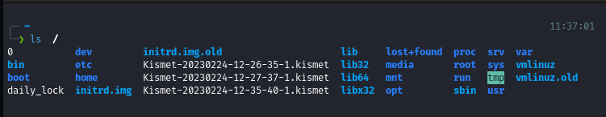
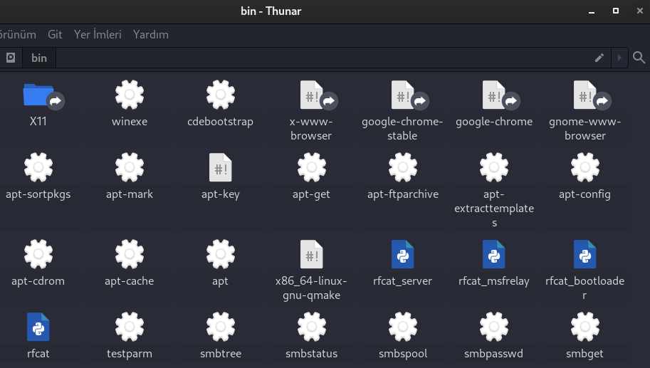
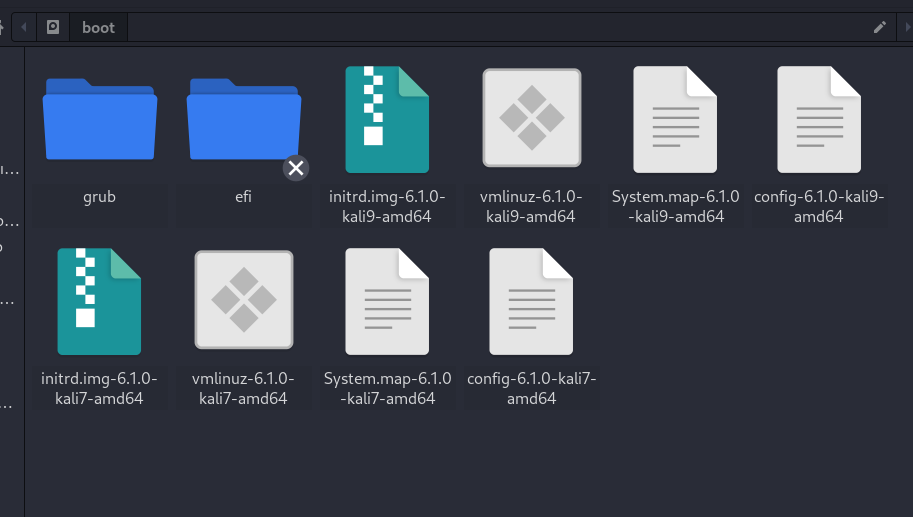
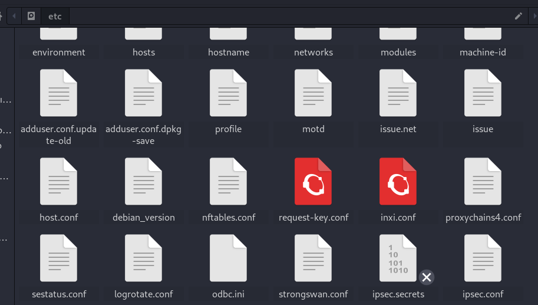
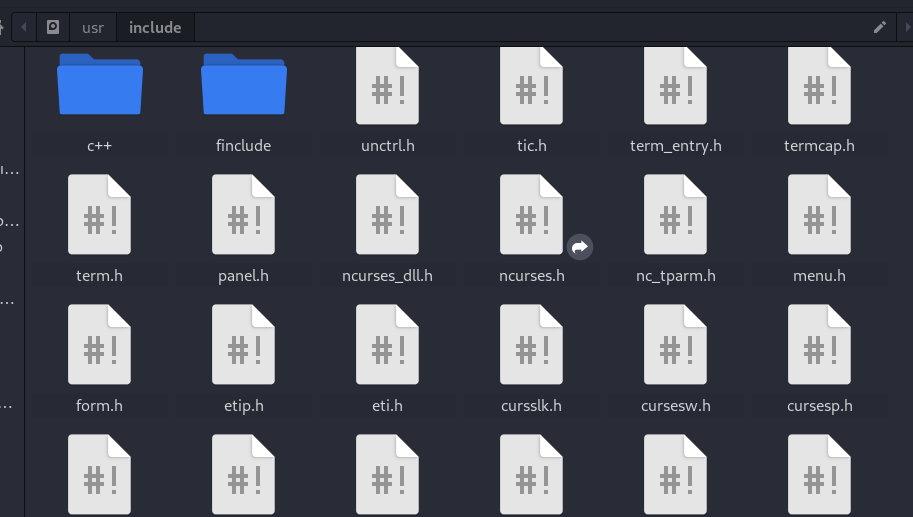
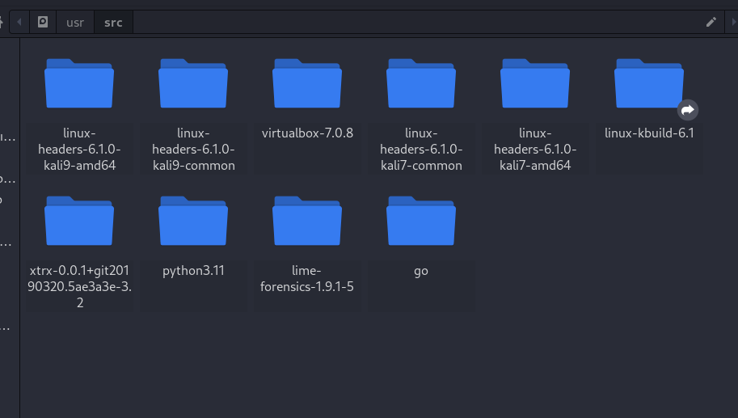
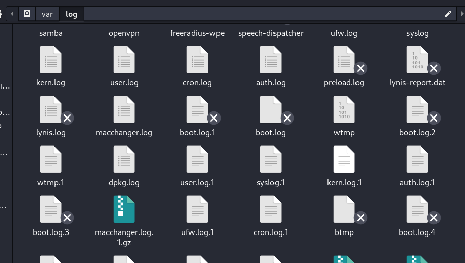

# Linux Dosya sistemi.

Linux ve unix like sistemlerin dosya yapıları bir ağaç kökü misali Hiyerarşisi sahiptir Windows'dan farklı olarak dağıtılmış dosya sistemi kullanılır ve buda sistemin daha verimli kullanılabilmesini sağlar.

## Dosya sistemi Hiyerarşisi:

- `/`: Root dizini (kök diyede geçer)

  - `/bin`:  İkili (binary) dosyalar (Sistemin çalıştırılabilir dosyaları).
  - `/sbin`: Sistem ikili (binary) dosyaları (root yetkisi gerekir).
  - `/boot`: Önyükleme dosyaları, çekirdek imajı grub configleri vs.
  - `/dev`:  Aygıt dosyaları (linux üzerinde herşey bir dosyadır).
  - `/etc`:  Tüm sistemin apılandırma ve ayar dosyaları. 
  - `/home`: Kullanıcıların kendine özel ev dizinleri.
  - `/lib`:  Paylaşılan kütüphane dosyaları.
  - `/media`: Çıkarılabilir ortamların bağlandığı nokta.
  - `/mnt`:  Geçici olarak bağlanan dosya sistemleri.
  - `/opt`:  Kendi kütüpahneleri ile gelen ek yazılımların yüklendiği dizin.
  - `/proc`: Çalışan süreçlerin bilgilerini içeren sanal dosya sistem.
  - `/root`: root kullanıcısın ev dizini (/ değil kullanıcının).
  - `/run`:  Çalışma zamanı verileri (PID dosyaları, soketler, vs.)
  - `/srv`: Servis verileri
  - `/sys`: Sistem aygıt ve sürücü bilgileri
  - `/tmp`: Programların çalışırken kullandığı geçici alan.
  
  - `/usr`: Kullanıcılara ait veri ve program dosyaları
    - `/usr/bin`: Kullanıcı ikili (binary) dosyaları
    - `/usr/include`: Başlık dosyaları (C ve C++ headerları.)
    - `/usr/lib`: Kullanıcı kütüphane dosyaları
    - `/usr/local`: Sisteme yerel olarak yüklenen yazılımlar
    - `/usr/sbin`: Kullanıcı sistem ikili (binary) dosyaları 
    - `/usr/share`: Ortak veri paylaşımı
    - `/usr/src`: Kaynak kodları

  - `/var`: Değişken veriler
    - `/var/log`: Günlük (log) dosyaları
    - `/var/mail`: E-posta kutuları
    - `/var/spool`: İşlemler için geçici veri saklama
    - `/var/www`: apache2 ön tanımlı web dosyaları

 
Çalışmış olduğumuz sistemin dosya sistemini ve yapısını bilmek herzaman iyidir şimdi daha ayrıntılı olrak işleyelim bunları.
  

## "/" kök dizini:
Tüm sistemin bağlandığı noktdır tüm dosyalar neticide bu noktaya bağlanmaktadır "root dizini" veya "kök dizini" diye geçmektedir 
bu dizin üzerinde normal kullanıcıların işlem yapma izni yoktur sadece sistem sahibi "root" un yetkileri ile işlem yapılabilir.
  Örnek olarak herhangi bir `/` dizini.

  

## "/bin" dizini:
Kullanıcıların kendi yetkileri ile çalıştırabileceği ikili dosyalar (binary) burada bulunmaktadır shell de bir komut
çalıştırıldığı zaman komutu bu dizinlerde aramaktadırlar sadece derlenmiş dosyalar değil çalıştırılabilir her dosya burada 
kullanılabilmektedir. Aynı zamanda `/bin` ve `/sbin` sistem yüklenirken ilk tanınan dizinlerdir yani sistemde bir sorun olduğu 
zaman kurmartma işlemi esnasında buradaki komutlar tanınacaktır. Buradaki komutlara örnek olarak `ls`, `cd` , `pwd`
 

## "/sbin" dizini:
Sistem genelinde değişiklik yapabilecek root yetkisi isteyen komutları barındıran noktadır normal kullanıcıların shell'i bu 
noktayı tanımaz çünkü yetkileri yoktur. Gene `/bin` gibi sistem açılışında ilk tanınan noktadır. Buradaki komutlara örnek olarak
`apt`, `dpkg` örnek verilebilir.
  

Örnek olarak herhangi bir `/bin` dizini.

  

## "/boot" dizini:
Gene önemli dizinlerden birisidir sitemin açılışında görevlidir çekirdek (kernel) imajının grub ayarlarının vs tutulduğu noktadır 
buradaki dosyaar ile sitem açılır. Açılış sürecinde ilk olarak `initramfs` denen bellek imajı yuklenir bu dosyanın görei asıl 
kernel belleğe yüklenene kadar sistemi temel olarak başlatmak ve kernele yardımcı olmaktır dah sonra gene `/boot` altındaki 
`vmlinuz*****` adlı kernel yüklenerek sistem başlatılır.   
 
Örnek olarak herhangi bir `/boot` dizini.

  

## "/dev" dizini:
Linux'da tüm sistem herşey birer dosyadır bu nedenle aygıtlarda birer dosyadır ve bu aygıt dosyalarının saklanmış olduğu noktada
`/dev` dizinidir zaten "device" ın kısaltması olmasından anlaşılabilir. Burada ssd, hdd ekran kartımız ses kartımız tüm aygıt 
dosyaları bulunmaktadır mesela `/dev/video0` sistemde webcam varsa bu isimde olabilir yüksek ihtimalle.

 

## "/etc" dizini:
Sistemin beyni denebilir bütün sistemin kullanmış ve kullanacağı config "ayar" dosyaları burada bulunmaktadır zorunlu olmamakla 
beraber uzantıları genellikle `*.conf` dur. Sisteme ilk kez giriş yapacak kullanıcıların vs ayarları otomatik buradan okunur bu 
nedenle değişikliklere dikkat edilmeli dosyalarla oynanmadan önce doğru şekilde yedeklenmeli ve izinlerine dikkat edilmelidir.

- `/`:
    - `etc`:
        - `resolv.conf` : DNS ayarlarını tutan dosyadır.
        - `shadow`      : Kullanıcıların parolalarının şifrelenmiş şekilde tutan dosyadır.
        - `passwd`      : Genel kullanıcı bilgilerini tutan dosyadır.
        - `bash.bashrc` : Bash shell'inin ön tanımlı ayar dosyasıdır.
 

Örnek olarak `/etc` aldındaki bazı dosyalar verilmiştir.
 

Örnek olarak herhangi bir `/etc` dizini.

  

## "/home" dizini:
`root` kullanıcı hariç diğer kullanıcıların `/` altında işlem yapmasın izin verilmedğini biliyoruz bu nedenle kullanıcıların
kendilerine ait belgeleri özel verileri vs tutabilmesi için gerekli olan alanları `/home/kullanıcı_adı` altında olmaktadır.
Birde dip not dizinin adı kullanıcının genelde kendi adıyla olur ama gene zorunlu bir durum değildir.

 

## "/lib" , "/lib32" ve "/lib64" dizinleri:
İsimlerindende anlaşılacağı üzere paylaşılan kütüphanelerdir Windowsdaki gibi her program gerekli kütüphaneleri tekrar kendisi için
indirmek yerine sitem genelinde kütüphane klasörlerine atılır bu sayede sistemin gereksiz şişmesi engellenir. Peki farklrı 
nelerdir.

| Dizin     | Özelliği | 
|-----------|----------|
|  /lib     | 32 bit mimariye sahip eski programların çalışabilmesi içindir 64 bit sistemlerde eskiye dönük uyumluluk sağlar |
|  /lib32   | `/lib` ile aynı işlevi görür bazı sistemlerde farklı isimlerde olabilir |
|  /libx32  | x32 denen özel bir mimari için kullanılan kütüphane dosyalarıdır |
|  /lib64   | 64 bit sistemlerde bulunur 64 bitlik mimaride çalışan programlar içindir |

Mesela bir program curl kütüphanesine bağımlı bunu daha önce ihtiyaç duyulduğu için kurulduysa tekrar kurulmz paylaşımlı 
kutuphane sayesinde kullanır. 
 

## "/media" dizini:
Pek bir olayı yoktur çıkartılabilir aygıtların usb belleklerin vs kullanmak için bağlanıldığı noktadır.
 

## "/mnt" dizini:
Geçici olarak bağlanan dosya sistemlerini veya ağ paylaşımlarını barındırmak için kullanılır. Özellikle sistem yöneticileri 
tarafından kullanılır ve manuel olarak bağlanan dosya sistemlerini içerir. Örneğin, bir ssd disk, usb bellek veya nfs /mnt 
dizinine bağlanabilir. /mnt genellikle sisteminizin kök kullanıcısı tarafından yönetilir ve sisteminizin yapılandırmasına bağlı 
olarak önceden belirlenmiş dizinlere sahip olabilir.
 

## "/opt" dizini:
Genellikle dış kaynaklardan kurulan ve kendi kütüphaneleri ile gelen yazılımlar buraya kurulur mesela örnek olarak Google Chrome 
vs kendi kütüphaneleri vardır o yüzden `/opt`'a kurulur gene sistem genelinde kullanılacak olan elle kuracağımız yazılımları bu 
noktaya kurabiliriz. 
 

## "/proc" dizini:
Sistem'in ve çalışan süreçlerin anlık bilgilerini tutan sanal bir dosya sistemidir önemlidir, pek çok program buradaki bilgileri
kullanmaktadır. Mesela `/proc/cpuinfo` bu dosya işlemci bilgisini tutmaktadır.
 

## "/root" dizini:
Kök kullanıcısı (root) un ev dizinidir dizin olan root'un değil kullanıcı olan root'un ev dizinidir diğer kullanıcılardan ayrıdır.
 

## "/run" dizini:
Çalışan süreçlerin soketlerin vs süreç bilgilerini tutan klasördür. Örneğin `/run/docker.pid` dockerin pid numrasını tutar.
 

## "/srv" dizini:
Servis verilerini tutan dizindir. Örneğin, bir web sunucusu kullanıyorsanız, web sitelerinin dosyalarını /srv/www dizininde 
saklayabilirsiniz. Benzer şekilde, bir FTP sunucusu varsa, kullanıcıların dosyalarını  için /srv/ftp dizinini kullanabilirsiniz.
 

## "/sys" dizini:
`/sys` dizini, Linux kerneli tarafından sağlanan sysfs dosya sistemini yansıtır. sysfs, çalışan bir Linux sistemi üzerindeki 
aygıtlar ve sürücülerle ilgili ayrıntılı bilgileri sunar. Bu bilgiler, sürücü modülleri, ACPI (Advanced Configuration and Power 
Interface) verileri, PCI (Peripheral Component Interconnect) aygıtları, USB cihazları, CPU ve bellek bilgileri gibi çeşitli sistem 
bileşenlerini içerebilir.
 

## "/temp" dizini:
Geçici dosyaların tutulduğu dizindir mesela bi program çalışıyor geçici bir confi oluşturdu vs onlar tmp altında tutulur buradaki 
dosyalar her boot esnasında otomatik silinir ama kendi oluşturmadığınız herhangi bir dosyayı silmek sorun çıkartabilir.
 

## "/usr" dizini:
`/usr` dizini sistemin temel işletim sistemi özellikleri haricinde kullanıcıların kurmuş olduğu yerel programların vs içeriklernini
saklandığı noktadır buradaki dizinlerde "`/`" atındaki aynı özellikleri gösterirler farkı ise kullanıcılar tarafından kurulmasıdır.
 

## "/usr/include" dizini:
`/usr` altındaki önemli dizinlerden birisidir C ve C++ dillerinde kullanılan header yani başlık dosyalarının saklandığı bir 
noktadır derleme işlemleri esnasında buradaki header dosyalarından yararlanılır.
 

Örnek olarak herhangi bir `/usr/include` dizini.

  

## "/usr/src" dizini:
`source` dan kısaltılmıştır adı gibi kaynak kodların saklanmış olduğu noktadır mesela yeni bir kernel sürümü var buraya indirilir 
ve sisteme yüklenmeden burada derlenir.
 

rnek olarak herhangi bir `/usr/src` dizini.

  

## "/usr/share" dizini:
Bu dizin sistem geneli uygulamaların verilerinin paylaşıldığı noktadır mesela Thunar dosya yöneticisi sisteme eklenen her kullanıcı
tarafından kullanılabilir ama özelleştirmeler sadece bizim kullanıcımızda geçerlidir.
 

## "/var" dizini:
Bu dizin değişken kelimesinin kısaltmasıdır adı gibi değişken boyuttaki içeriklerin saklandığı noktadır web siteleri, email 
kutuları, log dosyaları vs burada saklanmaktadır.
 

## "/var/log" dizini:
Linux sistemlerde pek çok olay metin tabanlı dosyalara dakika dakika yazılmaktadır bu sayede sistemin yönetimi istikrarı ve 
güvenliği kontrol altında tutulabilmektedir bu metin tabanlı dosyalara log dosyası denmektedir birkaç istisna hariç sistemin 
logları `/var/log` altında tutulmaktadır bunları ayrıntılı işlicez zaten.
 

örnek olarak herhangi bir `/var/log` dizini.

  

## "/var/www" dizini:
Apache2 web sunucusunun debiandaki ön tanımlı host dizinidir bu dizin içerisindeki dosyalar hostlanacaktır değiştirilebilir ama 
bilmekte fayda vardır.

 

Ders sonu

