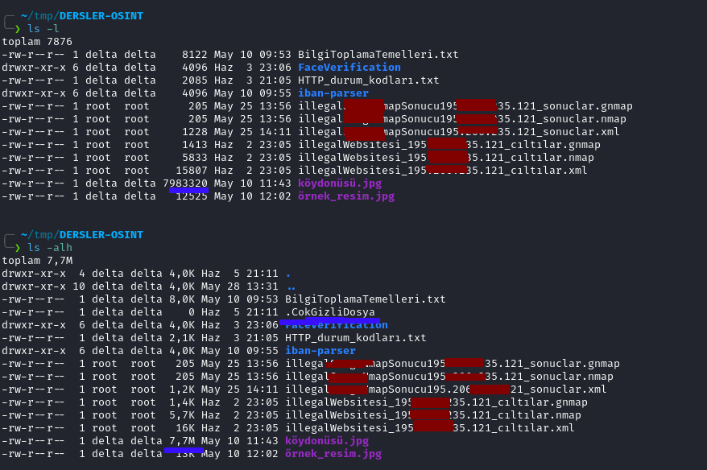

# Linux Temel Komutları 
<br>
<p>
Linux ve unix like sistemleri kullanırken temel komutları bilmek büyük oranda kolaylık sağlar. Genel olarak komutlar standartdır.

<br>
Detaylı olarak incelemeden önce tablo halinde genel amaçlarına bakalım.
</p>

| Komut | Kullanım amacı |
|-------|----------------|
| ls    | Dizin içeriğini listelemek için kullanılır |
| cd    | Change Directory, yani dizin değiştirmek için kullanılır | 
| pwd   | Anlık olarak bulunduğumuz dizini verir |
| rmdir | Boş klasörleri silmek için kullanılır |
| rm    | Genel amaçlı silme komutudur | 
| cp    | Kopyalama |
| mv    | Taşıma ve yeniden adlandırma | 
| cat   | Dosya okumak içindir | 
| grep  | Bir metin yığını içerisinde arama yapmak için kullanılır |
| chmod | Dizin ve dosya yetkilerini ayarlamamızı sağlar |
| chown | Dizin ve dosya sahipliklerini ayarlamamızı sağlar |
| sudo  | Yönetici yetkilerine sahip olmamızı sağlar | 
| man   | Yardım alma komutudur |
| help  | yardım alma komutudur |
| echo  | Ekrana metin ve değişken yazdırmada kullanılır |
| head  | Dosyanın ilk satırlarını okumamızı sağlar |
| tail  | Dosyanın son satırlarını okumamızı sağlar |
| touch | Boş bir dosya oluşturmamızı sağlar |
| mkdir | Klasör oluşturmamızı sağlar |
| history | Daha önce kullandığımız komutları görmemizi sağlar |

## ls komutu:

<p>List sözcüğünün kısatlması denebilir belirli bir klasörün içeriğinin listelenmesini sağlar ve belli parametreler almaktadır

```bash
ls          # Anlık bulunduğumuz dizinin içeriğini listeler 
ls /home    # /home klasörünün içeriğini listeler 
```
Aldığı parametreler:

| Parametre | Parametrenin Anlamı |
|-----------|---------------------|
| -a        | All demektir gizli dosyalarıda gösterir |
| -l        | Uzun ayrıntılı listeleme biçimini kullanır |
| -h        | Dosyaların boyutlarını insana uygun şekilde yazdırır |

<br>
Genellikle direk <i>ls -alh</i> şeklinde kullanılmaktadır.

Örnek olarak:
<br>

<br>
Mesela resimde mavi ile değişen noktalar belirtilmiştir.

</p>


## cd Komutu:
<br>
<p>Change Directory den gelmektedir bulunmuş olduğumuz dizini değiştirmemizi sağlar.
Almış olduğu bazı parametreler. <br>

```bash

cd ~                # Kullanıcının ev dizinine gider ör: /home/delta
cd ..               # Bir üst klasöre gider ör: /home/delta'dan /home altına 
cd Resimler         # Resimler adlı klasöre gider 
cd ../../           # 2 üst klasöre gider 
cd Resimler/tatil   # Resimler altındaki tatil klasörüne gider 
cd -                # Önceki konuma gider 

```

## pwd Komutu:
<br>
Anlık olarak bulunduğumuz konumu yazar herhangi bir parametresi yoktur.
Açılımıda <i>Print Work Directory</i> dir.

```bash
pwd         # çıktısı anlık konumdur ör: /usr/lib/
echo $PWD   # Buda sistem değişkenleri ile aynı işi yapar. 
```

## rmdir Komutu: 
<br>
Sadece boş klasörleri silebilmektedir bu nedenle pek kullanışlı değildir. Genelde rmdir yerine rm komutu kullanılır.

```bash
rmdir YeniBosKlasör     # klasörün içi boş ise siler değilse hata verir.
```

## rm komutu:
<br>
Silme işlemlerinde genellikle en çok kullanacağımız komutdur birkaç parametre alır.

| Parametre | Parametrenin Anlamı |
|-----------|---------------------|
| -r        | Recursive, iç yineleme demektir içi dolu klasörleri silmek için kullanılır.|
| -f        | Force, silinmeyen kilitli dosyaları silmek için kullanılır zorla siler dikkatli kullanılmalıdır. |
| -i        | Interactive, her silme işleminde kullanıcıya danışır. |

<br>
Kullanırken dikkat edilmelidir yanlışlıkla sistemi silebilir mesela <i>sudo rm -rf /</i> gibi bir komut sistemi kullanılmaz hala getirmek içindir ve asla girilmemisi gereklidir. rm komutuda diğer shell komutları gibi özel karakterlere duyarlıdır mesela * demek herşeyi kapsa demektir.

```bash
rm GüzelVideo.mp4           # Rahatlıkla silinir 
rm BosKlasör                # Klasör boş olsa bile -r eklemek gereklidir hata verecektir 
rm -r HerhangiBirKlasör     # Klasörü içindeki alt klasörlerle beraber silecektir 
rm -f KilitliÖzelDosya.txt  # Zorla silecektir 
# rm -rf * bulunduğu klasör altıondaki herleyi siler tehlikelidir 
rm Resimler/EskiResimler/*  # Resimler Altındaki eski resimler klasöründeki dosyaların hepsini siler 
```

## cp Komutu:
<br>
Dosyaları kopyalamak için olan komuttur. Yedekleme vs içinde kullanılmaktadır. 

| Parametre | Parametre Anlamı |
|-----------|------------------|
| -r        | Klasörleri kopyalamaya yarar |
| -i        | Dosyaların üzerine yazmadan önce sorar |


```bash
cp /etc/passwd ~/passwd.backup      # /etc/passwd dosyasını ev dizinine yedekledi
cp -r Resimlerim/   TatilResimleri  # Resimlerim klasörünü TatilResimlerin olarak kopyaladı
```

## mv Komutu:
<br>
Move dan gelmektedir dosyaları teşımak ve yeniden adlandırmak için kullanılır.

```bash
mv Proje1.mp4   EskiProje.mp4    # Proje1 i eski proje diye yeniden adlandırdık
mv Dersler/c.pdf sunum/          # Dersler altındaki c.pdf yi alıp sunum altına taşıdık
```

## cat Komutu:
<br>
Dosyaları okumak için ve yanı sıra kopyalamak için kullanılabir.

```bash
cat /etc/passwd                     # etc passwd dosyasını okur 
cat video.mp4  > video_kopya.mp4    # video.mp4 dosyasını kopyaladık
```

## grep Komutu:
<br>
Süzgeç görevi görmektedir.

| Parametre | Parametrenin Anlamı |
|-----------|---------------------|
| -i        | Büyük küçük harfe duyarlılığı kapatır |
| -A        | Aranan kelimeyi bulduktan sonra x adet satır göster | 
| -B        | Aranan kelimeden önceki x adet satırı göster |

```bash
grep "merhaba dünya" karışık_dosya.txt      # "merhaba dünya" metninin olduğu satırı getirir 
grep -i "MerHaba DünYA" karışık_dosya.txt   # Büyük küçük harf farketmeden gene aynı işi yapar
```

## chmod ve chown Komutları:
<br>
Change mode ve Change owner, dan gelmektedirler klasör ve dosyaların yetkilerinin, sahiplerinin değiştirilmesini sağlar bazı parametreler alırşlar izin kısmını başka derste işlicez. Burada sadece komutun temel syntax ını görecez ki gözümüz alışsın.Mesela chmod için örnek aşşağıda.

| Parametre | Parametrenin Anlamı |
|-----------|---------------------|
| --reference | Referans gösterilen dosyanın yetkilerini kullan |
| -R        | iç yinelemeli olarak tüm klasörü işle demektir tehlikelidir |

```bash 
chmod 500 dosya.txt             # dosya.txt ye 500 izinlerini işledi 
chmox -R 700  klasör_adı        # Klasöre ve alt klasörlerine 700 iznini işledi 
chmox --reference /etc/passwd yeni_dosya.txt    # /etc/passwd nin izinlerinin aynısını yeni_dosya.txt ye verdi
```


## sudo Komutu:
<br>
Super User Do, dan gelmektedir ve komutların önlerine gelerek komutların "root" admin yetkisi ile çalışmasını sağlar.
Dikkatli kullanılması gereken bir komuttur.

```bash
cat /etc/shadow         # herhangi bir kullanıcı bu komutu çalıştırınca erişim engellendi hatası alacaktır 
sudo cat /etc/shadow    # Ama sudo yetkilerine sahip bir kullanıcı bu şekilde ilgili dosyayı okuyabilir 
```

## man ve help Komutları:
<br>
Benzer komutlardır yardım almaya yararlar. Herkes her komutun her parametresini bilemiceği için neredeyse her komutun bir yardım menüsü (help) ve manuel dökümanı (man) vardır. Aslında help tam bir komut değildir her komutta bulunan bir parametredir diyebiliriz.

```bash
# Help için birkaç örnek 
sudo --help 
ls -h
htop --help 
```
Yukarıdaki gibi ya <i>--help</i> yada <i>-h</i> ile neredeyse her araçta basit bir help menüsü açabilirsiniz.
man komutu ise direk bir manuel sayfası açar 

```bash
man ls
man sudo
```
man sayfası help den daha detaylı ve yoğundur.


## mkdir Komutu:
<br>
Basit şekilde klasör oluşturmyı sağlar genelde pek kullanılan parametresi yoktur.

```bash
mkdir /home/user/deneme     # /home/user/ altında deneme adlı klasör açar 
mkdir Yeni                  # Bulunduğumuz dizinde Yeni diye klasör açar 
```

## history Komutu:
<br>
Termianlde bellir bir sayıya kadar eski komutlar saklanmaktadır bu geçmişe <i>history</i> komutu ile ulaşabiliriz.
Pek bir parametresi yoktur gene.

```bash
history     # standart kullanımı
history -c  # komut geçmişini temizler
```

## echo Komutu:
<br>
Ekrana herhangi bir yazı veya bir değişkenin değerini yazdırmamızı sağlar. Genelde kullanılmaz ama bilinmesi gereklidir.

```bash
# örnek bir metin yazdıralım
echo "Merhaba dünya"    
Merhaba dünya

# kullanıcın ev dizinini tutan bir sistem değişkenini yazdıralım
echo $HOME
/home/username
```

## touch Komutu:
<br>Dosya oluşturmamızı sağlar echo gibi pek bir olayı yoktur.

```bash
touch yeniDosya.py     # Bulunulan konumda yeniDosya.py dosyasını oluşturdur 
touch /tmp/not.txt     # /tmp/ altında not.txt yi oluşturdu 
```

## head Komutu:
<br>
Bir dosyanın ilk 10 satırını görmemizi sağlar ama istersek daha fazlasınıda gösterebilir.

```bash
head Yeni_200_satırlıkDosya.txt         # ilk 10 satırı gösterir 
head -n 30 Yeni300satırlıkDosya.txt     # ilk 30 satırı gösterir 
```

## tail Komutu:
<br>
Head komutunun tam tersidir bir dosyanın son 10 satırını gösterir aynı şekilde arttırılabilir.

```bash
tail BüyükDosya.txt         # son 10 satırı verdi 
tail -n 30 BüyükDosta.txt   # son 30 satırı verdi
tail -f dosya.txt           # son 10 satırı açar ve güncellemeye devam eder log dosyalarında çok kullanırız
```

</p>


