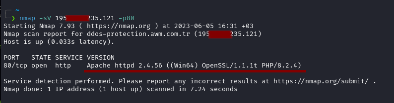

# Nmap ile network keşfi & port taraması.
<br>
<p>Nmap (Network Mapper), bir ağ keşif ve güvenlik taraması aracıdır. nmap hedef sistemler üzerindeki portların durumunu keşfetmek, portlar üzerinde çalışan servisleri ve versionlarının tespit edilmesini sağlayan bir araçtır pek çok parametresi vardır bunun yanında gelişmiş tarama özellikleri ve kendi script motoru vardır. Nmap ip adresi, ip aralığı ve domainleri tarayabilir.
<br>
</p>


## Örnek kullanımları ve açıklamaları. 
<br>


```bash

    # Temel tarama 
    nmap 192.168.1.1 

    # Domain taraması 
    nmap google.com 

```
<p>

### Stealth Tarama:

Stealth scan TCP 3 yönlü el sıkışmayı yarıda keserek bağlantı tamamlanmadan kapatır bu sayede firewall vs atlatma konusunda işimize yarar ama loglarda 
anormallik olarak görünecektir. Bağlantıyı yarıda kesme işlemi içinde sudo yetkilerine ihtiyaç duyar.

```bash
    
    sudo nmap -sS 192.168.1.1 

```
</p>

<p>

### Versiyon taraması:

Nmap portlarda çalışan servisleri ve versionlarını tespit edebilir bunu farklı yollarla yapabilir en basit örneklerden biri hatalı & yanlış istekler atarak 
sunucuların hata mesajlarını yakalamak ve parsellemektir örnek olarak.

<br>
Nmap ile ip adresinin 80 portunu tarayalım 

```bash 
    # nmap komutumuz 
    nmap -sV 195.XXX.235.121 -p80
```



<br>
<br>

Birde telnet ile 
```bash 
    # telnet komutumuz 
    telnet 195.XXX.235.121 80
```


<br>
Görüldüğü gibi aynısını aldık nmap bu tip farklı yöntemler tespit edebilmektedir.
Bunların yanında nmap'in güçlü bir sciprt motoru var "Nmap Script Engine" bu scriptler lua dili ile yazılmıştır ve gayet 
başarılıdırlar. <i>"/usr/share/nmap/scripts/"</i> konumu altında bulunurlar <i>--script</i> parametresi ile kullanılırlar.

<br>
Scriptleri kullanırken dikkat edilmesi gereken nokta bu scriptlerin her port için tek tek kullanılacak olmasıdır buda aşırı miktarda trafik ve sunucuda yük'e sebep olur bu nedenle doğru scripti ve portu seçmek önemlidir.
<br>

```bash
    # vuln katagorisindeki scriptler ile 80 portunu tarayalım ve zafiyet varmı bakalım hemen 
    nmap --script=vuln 195.XXX.235.121 -p80
```


<br>
Resimdeki gibi bir sonuç aldık bize bu katagorideki scripler ile tarama yapmış ve slowloris zaafiyetinin olma ihtimali yüksek olduğunu söylüyor, cve numrası ve bulunma tarihi ile beraber.


<br>
<br>
</p>

## Nmap parametreleri ve anlamları:
<br>
<p>Nmap yukarıda anlattıklarımız ile sınırlı değildir aşşağıdaki tabloda parametrelerinin çoğu örnekler ile verilmiştir.</p>
<br>

| Parametre | Parametre'nin anlamı | Örnek kullanımı 
|-----------|----------------------|-------------------
| -iL       | taranacak adreslieri dosya halinde vermemizi sağlar | -iL taramaListesi.txt |
| --exclude | belli bir ip aralığının veya adreslerin taranmamasını sağlar | --exclude 192.168.1.22 | 
| --excludefile | hariç tutulacak adresleri dosya olarak belirtmemizi sağlar | --excludefile taranmicak.txt |
| -sn       | ping taramsaı yapar port taraması yapmaz | -sn (parametre almaz) |
| -Pn       | ping taraması yapmaz her ip adresnin ayakta olduğunu varsayar | -Pn (parametre almaz) |
| -n        | dns çözümleme yapmaz | -n (parametre almaz) | 
| -R        | her zaman dns çözümlemesi yapar | -R (parametre almaz) |
| --dns-servers | nmap'in kullanması için özel dns belirtmemizi sağlar | --dns-serveers 1.1.1.1,8.8.8.8 |
| --system-dns | sistemin dns sunucusunu kullanır | --system-dns (parametre almaz) |
| --traceroute | sistemimizden hedefe kadar paketlerin geçtiği adresleri gösterir | --traceroute (parametre almaz) |
| -sS | Stealth scan diye geçer firewall vs atlatmayı sağlar ama loglarda çok bariz çıkarsınız | -sS (parametre almaz) |
| -sU | UDP taraması yapar | -sU (parametre almaz) |
| -p  | belirli bir portu veya port aralığını taramamızı sağlar normalde en çok kullanılan 1024 port taranır | -p80,443 | 
| --exclude-ports | ilgili portları tarama demektir | --exclude-ports 12-22 |
| --top-ports | en çok kullanılan x adet portu tarar | --top-ports 250 | 
| -sV       | version taramasıdır portlarda çalışan servislerin versionlarını testpit etmeye çalışır | -sV (parametre  almaz) | 
| --version-all | tam ayrıntılı version bilgisi verilmesini sağlar | --version-all (parametre almaz) |
| --script | belirli script veya scriptler'in taramada kullanılmasını sağlar | --script=vuln |
| --script-updatedb | script veritabanını günceller | --script-updatedb (parametre almaz) | 
| -O | işletim sistemi tespit etmeyi etkinleştirir | -O (parametre almaz) |
| -T | tarama hızını belirler 0-5 arasıdır 5 en hızlı 0 en yavaş | -T5 | 
| --host-timeout | tarama zaman aşımı süresini belirler | --host-timeout 10 | 
| --scan-delay | tarama istekleri arasına konulacak süre | --scan-deleay 1 | 
| -S | isteklerin başka ip adresinden geliyor gibi gösterir | -S 1.1.1.1 | 
| -e | taramanın hangi network kartı ile yapılacağını belirtmemizi sağlar | -e eth2 | 
| --proxies | taramaları proxy üzerinden yapmamızı sağlar | --proxies http://127.0.0.1:8080 | 
| --data-string  | gönderilen paketlerin sonuna belirtilen ascII metni ekler | --data-string "ss12" | 
| --data-length | gönderilen paketlerin sonlarına ilgili uzunluk kadar rastgele veri eklenir | --data-length 22 | 
| --badsum | paketleri sağlama değerleri bozuk şekilde gönderir | --badsum (parametre almaz) |
| -oA | ilgili isim ile tüm formatlarda çıktıyı kaydetmemizi sağlar | -oA nmap_sonucları | 
| -v  | verbose demektir sonuna v ekleyerek bilgi verme seviyesi arttırılabili | -vv |
| --open | sadece açık veya açık olma ihtimali olan portları gösterir | --open (parametre almaz)
| -6 | ip version 6 taramasını aktif eder | -6 (parametre almaz) |

<br>
<br>

## En çok kullanılan portlar ve ön tanımlı servisleri.

<br>
<p>Hangi portta ön tanımlı hangi servisin çalıştığını bilmek büyük kolaylık sağlar ama unutmamak lazım servislerin çalışma portları değiştirilebilir.</p>
<br>

| Port | Servis                      |
|------|-----------------------------|
| 21   | FTP (File Transfer Protocol)|
| 22   | SSH (Secure Shell)          |
| 23   | Telnet                      |
| 25   | SMTP (Simple Mail Transfer Protocol)|
| 53   | DNS (Domain Name System)    |
| 80   | HTTP (Hypertext Transfer Protocol)|
| 110  | POP3 (Post Office Protocol) |
| 123  | NTP (Network Time Protocol) |
| 143  | IMAP (Internet Message Access Protocol)|
| 443  | HTTPS (HTTP Secure)         |
| 445  | Microsoft-DS (smb file transfer)|
| 1433 | Ms-SQL (Microsoft db system) |
| 2082 | Cpanel default port |
| 2083 | Cpanel SSL default port |
| 2222 | DirectAdmin default port |
| 3389 | RDP (Remote Desktop Protocol)|
| 3306 | MySQL Database              |
| 5432 | PostgreSQL Database         |
| 5900 | VNC (Virtual Network Computing)|
| 6667 | IRC (Eş zamanlı sohbet) |
| 8080 | HTTP Alternate              |
| 8443 | HTTPS Alternate             |

<br>
<p>Dersin sonu.</p>

