# Yüz tanıma sistemleri
<p>Geçmişten günümüze güvenlik sistemleri ve kimlik doğrulama çok önemli bir alan olmuştur.
Bu alanlarda kullanılan bir yöntemde biyometrik verilerimizdir bu verilerin değiştirilmesi pek mümkün 
olmadığı için kimlik doğrulama ve tespitinde günümüzde çok fazla kullanılmaktadır gerek iyi gerek asyadaki insan fişleme sistemlerinde olduğu gibi. 

<br>
<br>

Yüz tanıma sistemleri temel olarak insan yüzünün matematiksel farklılıklarını kullanır ve buna göre çalışır. Yüzün belirli noktaları referans alınır ve Trigonometri kullanılarak bunların uzaklıkları hesaplanır bu okulda bize öğretilen formül ezberleme durumu gibi değildir tabiki. Hesaplama sonucunda yüze özel bir oran çıkar bu oran sayesinde işlemler yapılır. 

## Günümüzde kullanılan bazı yüz tanıma ve tespit modelleri.
- FaceNet (Google)
- ArchFace
- VGGFace 
- DeepFace
- LightCNN (Microsoft)


<br>
Biz osint serisinin bu dersinde exadel-inc in açık kaynak olarak sunduğu CompreFace yazılımının 
kurulum ve kullanımı görecez. Neden bu yazılım noktasına gelirsek diğer sistemlere göre webUI ile kullanımı ve yönetimi daha basit ve ek ayalarmalara gerek duymadan oldukça iyi sonuçlar veriyor.


## CompreFace kurulum ve kullanımı:

[CompreFace resni GitHub sayfası](https://github.com/exadel-inc/CompreFace)

Biz ön tanımlı model yerine daha yavaş ama daha doğru sonuçlar veren ArchFace modeli ile kurulum yapacaz o yüzden release kısmı yerie direk repodan bize gereken kısmı çekelim.

<br>

```shell
# Çalışma klasörümüzü açalım 
mkdir CompreFace

# Çalışma klasörüne girelim
cd CompreFace

# Docker Compose için ana dosya
wget https://raw.githubusercontent.com/exadel-inc/CompreFace/master/custom-builds/SubCenter-ArcFace-r100/docker-compose.yml

# Değişken bilgilerini içeren dosya 
wget https://raw.githubusercontent.com/exadel-inc/CompreFace/master/custom-builds/SubCenter-ArcFace-r100/.env

```
<br>

Reponun boyutu bir tık büyük olduğu için (yaklaşık 300mb) direk tüm repoyu çekmeye gerek yok.


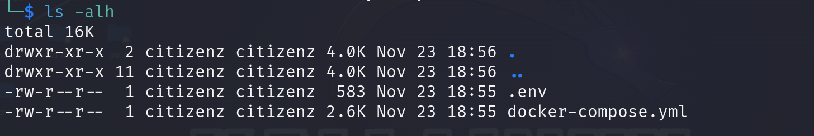

<br>

Görüldüğü gibi gerekli dosyalarımız gelmiş şimdi bunu çalıştırmak için gerekli olan `docker` ve `docker-compose` paketlerimizi kuralım.

```shell
# DockerCompose ile docker otomatik kurulacaktır
sudo apt install docker-compose -y
```

<br>

`docker-compose` nin çalışması için docker'in servis olarak arkaplanda çalışması gerekiyor bu nedenle başlatma veya kurulum öncesi buna dikkat ediyoruz.

```shell
# servis açıksada kapaıp açar değilse sadece açılmasını sağlar 
sudo systemctl restart docker
```
<br>

Şimdi CompreFace çalışma klasörümüzde aşşağıdaki komutu vererek kurulumu başlatabiliriz.

```shell
sudo docker-compose up -d
```
<br>

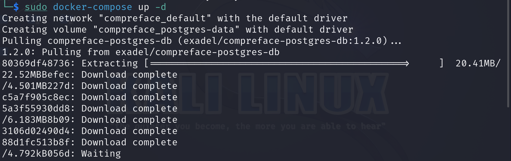

<br>
Yukarıdaki resimde görüldüğü gibi gerekli indirmeleri yapmaya başladı 
bu işlem internet hızınıza bağlı olarak süresi değişecektir ama fikir vermek açısından indirme sonrası boyutlar altdaki resimdeki gibi olacaktır.

<br>

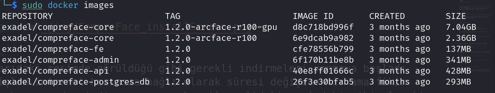

<br>
Bende ek olarak GPU modeli kurulu o nedenle ek olarak görünüyor ama uyumluluk için bu yazıda CPU üzerinden çalışan modeli kurmaktayız yani o kadar alan yemicektir sizde.


## İndirmeler bittikten sonra başlatma kullanım ve durdurma.

<br>
Evet indirmelerimiz ve kurulumlarımız bitti şimdi başlatma ve kullanıma sonrasındada kaynak yememesi için durdurma kısımlarına bakalım.

İndirme işlemi sonrasında otomatik başlayacaktır sistem ama başlatma komutumuz zaten aynı.


```shell
# Çalışma dizini içerisinde çalıştırılması gerek
sudo docker-compose up -d
```

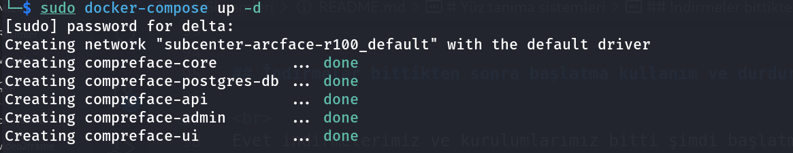

<br>
Başlatmalar esnasında fan hızı artlabilir doğal olarak hafif bir program değil çünkü. Şimdi web arayüzüne girmek için tarayıcıdan `http://localhost:8000` adresine gidelim.

<br>


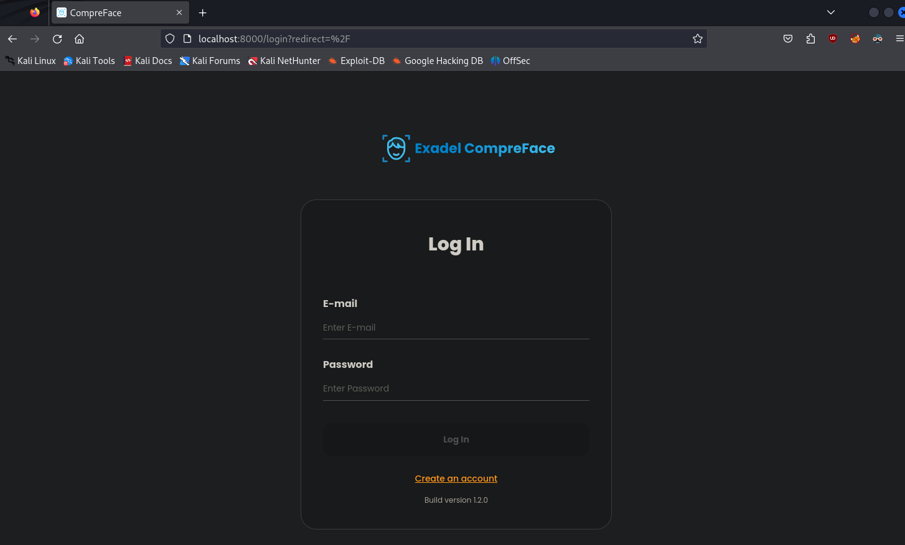

<br>

Burada ilk girişinizde admin hesabı oluşturmanızı isticektir aktif bir mail ile oluşturmanızı öneririm çünkü şifreyi unutursanız pek tatlı olmaz sonu uğraşırsınız. Bende direk login ekranı geldi çünkü aktif olarak hesabım var kendi sistemimde.

<br>
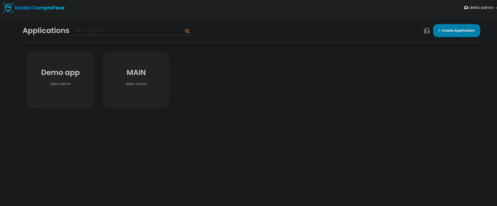

Giriş yaptığınız zaman ilk olarak bir uygulama oluşturmanızı ister oluşturmasanızda daha sonra oluşturulabilir. Sizi karşılicak ekran aşşağı yukarı üstdeki resimdeki gibidir, sağ üstteki `uygulama oluştur` simgesine tıklayıp kendimize bir uygulama açalım.

NOT: Ayrıca test yapmanız için hazır bir demo uygulamada gelmektedir içinde.
<br>


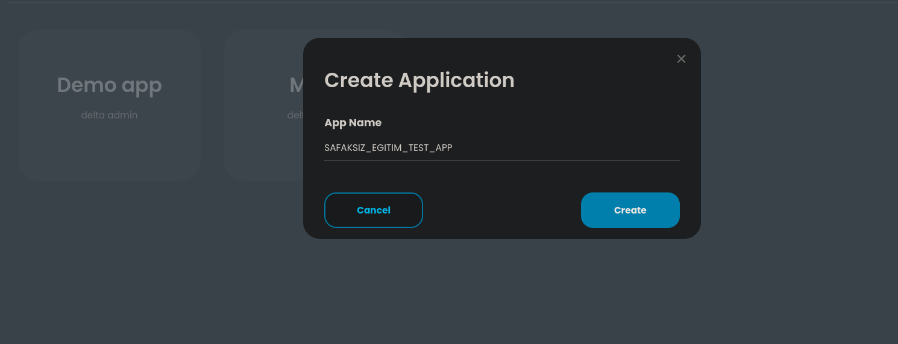

<br>

Şimdi oluşturduğumuz uygulamanın içine girince boş olacaktır çünkü bu uygulama için servis tanımlamadık gene sağ üstteki `oluştur` butonu ile kendimize amacımıza uygun bir servis açalım. Açabileceğimiz 3 tip servis vardır bunlar RECOGNITION (Çok sayıda yüz eklediğimiz bir veritabanından yüz arama), DETECTION (sadece tespit etme), VERIFICATION (bize en cok lazım olan yüz doğrulama) servisleridir biz verification seçiyoruz ve oluşturalım.
<br>

Oluşturduktan sonra otomatik olarak listeye gelecektir bu listeden tıklayıp girelim altdaki gibi bir ekran bizi karşılicaktır.

<br>
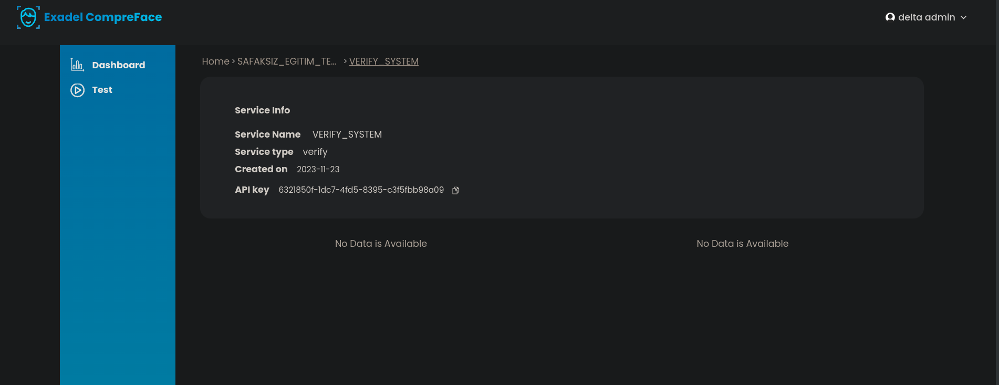

<br>

Yukarıdaki resmimize bakalım ve temel olarak gördüklerimizi inceliyelim şimdi. Burada bize servisin adı, tipi, oluşturulma tarihi, sdk'ler için api keyimizi vermis alt kısımda `no data` diyen kısımlar kullanım istatistikleri kısmıdır zamanla oluşmaya başlar. Sağ taraftaki menüden `Test` kısmına girersek artık doğrulama için kullanacağımız ekrana gelmiş oluruz, tıklayıp girelim.

<br>

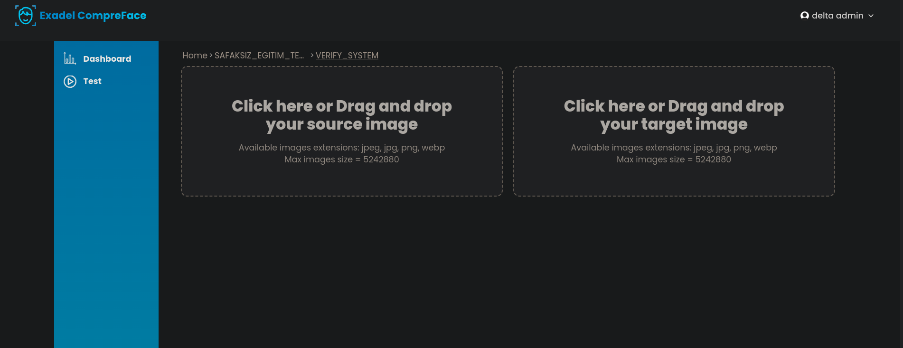

Üstteki ekran'da göründüğü gibi 2 adet resim seçmemiz isteniyor. Burada dikkat edilmesi gereken nokta soldaki resim bizim hedef resmimiz olmalıdır yani bildiğimiz veya aradığımız kişi olmalı oraya konacak resim ve sol kısıma sadece içinde 1 adet yüz bulunan bir resim konulması gerekiyor yoksa hataverecektir sağdaki kısma çok fazla yüz içeren resimler konulabilir o resimdeki yüzlerin çoğunu algılar ve test eder şimdi denemeye geçelim.

<br>

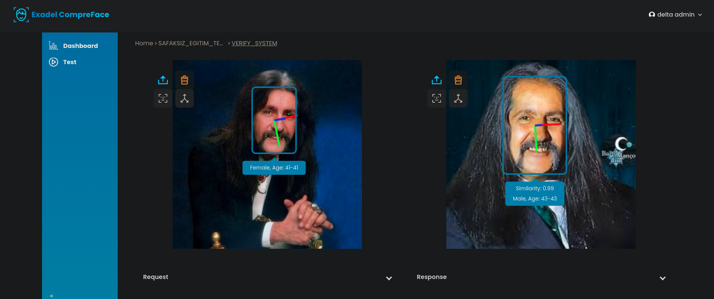


<br>

İlk karşılaştırmalarımızı rahmetli Barış Manço üzerinden yapalım yukarıda göründüğü gibi. Cinsiyet tahmini pek tutarlı olmasada yaş tahmini iyi denecek seviyededir yüz benzerliği konusunda OSINT için yeterli düzeyde bir veri modeli var dnebilir. Benzerlik oranı sol resimdeki mavi kutuda `similarity` olarak geçer bu oran `0.x` olarak yazar `1.0 = %100` şeklindedir hesaplaması yani `0.9 = %99` anlamına gelir doğru bir tespit ama bir sistem sadece aynı resimlerle denenmez birde farklı resimler ile deneyelim.

Not: Altdaki `response` yazan kısımlara tıklarsanız api ile olan iletişimi gösterir analiz esanasındaki.

<br>


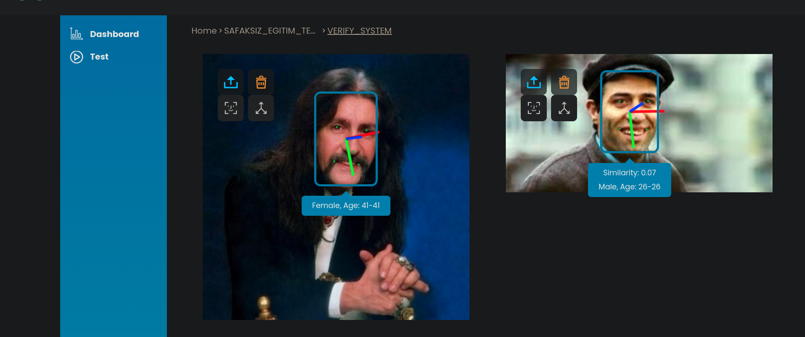

<br>

Evet bu sefer iki rahmetliyi karşılaştırdık ve gene bize tatmin edici doğru sonuçlar verdi. Kemal Sunal ın barış manço ile benzerliğine `0.07` yani `%7` gibi bir oran verdi buda sistemin doğruluğu açısından bize bilgi vermiş oldu kesin olarak her sonuca güvenilmemesi gerekiyor ama genede bize etkili miktarda fikir verir bu.

## Doğruluğu etkileyen faktörler nelerdir?

<br>
Bu işlemin doğruluğunu pek çok faktör belirler.

- Resim çözünürklüğü 
- Kişinin duruş pozisyonu
- Işıklandırma 
- Sonradan oluşan yaralar ve estetik operasyonlar 
- Genetik benzerlikler
- Yetersiz veri modeli

Çok düşük çözünürklük yüz hatlarının yanlış tanınmasına, yandan çekilmiş bir resim yeteri kadar yüz hattının algılanmamasına sebep olabilir. Aynı şekilde mesela bülent ersoy gibi aşırı estetik geçiren birisinin öneki hali yüz tanıma ile tespit edilemez bunun yanı sıra dünya üzerinde yüz hatları bize %90 civarı benzeyen ortlama 7 kişi vardır bunlarda algoritmayı kandırabilir ve özellikle yetersiz veri modelide yanlış tanımlamaya neden olabilir CompreFace başlangıç için yeterli denebilecek bir veri modeliyle gelir ama.

<br> 

Yukarıdaki pek çok durumu kendim test ederek bunu doğruladım.

<br>

## Programı kapatma.

<br>

İşimiz bittikten sonra böyle güçlü bir sistemi aktif tutmaya gerek yoktur kapatabiliriz herhangi bir veri kaybımız vs olmaz tekrar başlatınca geri gelir. Kapatmak için komutumuz şudur.

```shell 
sudo docker-compose 
```

<br>

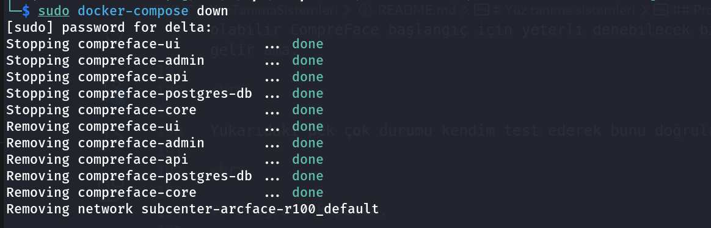

<br>

Bu işlemde gene sistemine göre birkaç dakika sürebilir `removing` dediğine bakmayın herhangi bir veri silinmez.

<br>
Bu derslik bukadar dostlar kendinize iyi bakın diğer yazılarda ve eğitimlerde görüşmek üzere.


</p>