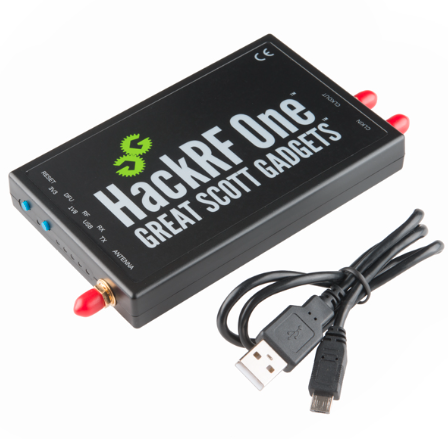

# 1: SDR ve SIGINT nedir?

 
SDR (Sofware Defined Radio) geleneksel radyoların belirli bir aralıkta donanımsal olarak kontrol edilmesinin aksine yazılımsal olarak radyonun çalışmasına müdahale edilmesini sağlamaktadır bu sayede maaliyet açısından kazançlı daha esnek ürünler ortaya çıkmasını sağlamıştır. 

 

En sık duyulan SDR ürünlerinden bazıları: <B>RTL-SDR, HackRF, BladeRF, AirSpy</B> bunların pek çoğu internet üzerinde bulunabilir ama genel olarak ülkemizde USD kuru nedeniyle en uygun olan <B>RTL-SDR</B> olarak bilinendir.

<h2>Kısaca Genel Özellikleri: </h2>
 
<h4>HackRF </h4>
 
HackRF <B>1mhz - 6ghz </B> aralığında radyo sinyallerini dinlemek ve yayın yapmak için kullanılan bir SDR dir.

* HackRF:
    * 1 mhz - 6ghz yayın alma & verme aralığı.
    * USB 3.0 desteği 
    * Half-duplex veri transferi 
    * 0.1w çıkış gücü.

 

 
 
<h4>RTL-SDR: </h4>
 
RTL-SDR <B>500khz (0.5hmz) - 1.7 ghz</B> aralığında sadece alım yapabilen HackRF den daha uygun fiyatlı bir SDR dir derslerimizde RTL-SDR üzerinden gitmektedir. RTL-SDR nin v1 v2 v3 ve v4 sürümleri vardır biz en yaygın olan blog v3 sürümünü kullanacağız amazon üzerinden tedarik edilebilir ama orjinal olmasına dikkat etmek lazım markası ile adı aynıdır bu ürünün.

 

RTL-SDR nin HackRF den daha düşük olmasına rağmen gayet güzel işlemle yapılabilmektedir.

* RTL-SDR:
    * 0.5mhz - 1.7ghz alım aralağılı.
    * simplex'tir 

 

 

<h5>RTL-SDR orjinal ve sahte olanları kontrol etmek için orjinal katalog: </h5>

 
<h3> Peki Neler Yapılabilir Bu RTL-SDR ile ? </h3>

* Yapılabilecekler:
    * FM radyo dinleme
    * Kısa dalga (shortwave) dinleme
    * Uçak - kule konuşmalarının dinlenmesi 
    * ADS-B uçak radalararından bilgi toplama
    * Amatör telsizlerin dinlenmesi 
    * 112 gibi acil durum kurumlarının DMR telsizleri 
    * Ticari amaçlı DMR ların dinlenmesi 
    * Ticari amaçlı PMR telsizlerin dinlenmesi 
    * Gsm gen 2 (2g) üzerinden yapılan aramaların ve sms lerin dinlenmesi 
    * HDMI kablolarından sızan görüntülerin dinlenmesi 
    * NOAA (15, 18, 19) ahava durumu uydularından görüntü alınması 
    * METEOR-m2 2, m2 3 uydularından görüntü alınması 
    * METOP-3 den görüntü alınması 
    * GPS sinyallerinin spektrumunun görüntülenmesi 
    * Şifreli konuşmaların yakalanması 
    * Halka açık olmayan uyduların dinlenmesi 
    * Yüksek çözünürklüklü bölgesel görüntüler alma 
    * LNB gibi sinyal frekansını düşüren araçlar ile daha fazlası 
        * QO-100 ( Katar Oscar 100) uydusundaki amatörlerin dinlenmesi
        * TV yayınlarının spektrumunun görüntülenmesi

Şeklinde geniş kapsamlı bir alanı bulunmaktadır yasal çerçevede elimizden geleni göstereceğiz.

