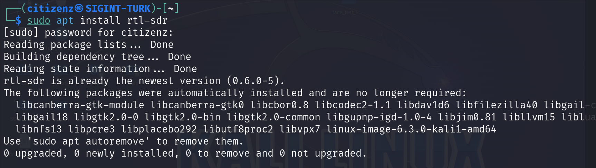

<p>

# Yazılım ve Driver Kurulumları

<br>
Yazılım tanımlı radyo sistemimizin bilgisayarlarımız tarafından görülebilmesi için belirli yazılım ve sürücülerin kurulması gerekmektedir bu bölümde onları işlicez. Bu dersleri Kali Linux 2023.3 sürümü üzerinden yapacam.


<br>

```shell
# RTL-SDR için
sudo apt install rtl-sdr -y

# HackRF için
sudo apt install hackrf -y

```

<br>




## SDR++ yazılımın kurulması.

<br>
Şimdi neredeyse çoğu işlemimizi yapacağımız SDR++ yazılımı kurmaya geçelim bu yazılım bize grafiksel bir arayüz ile rtl-sdr cihazımızı yönetmemize olanak sağlar.


</p>