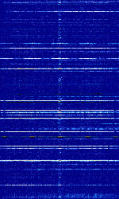
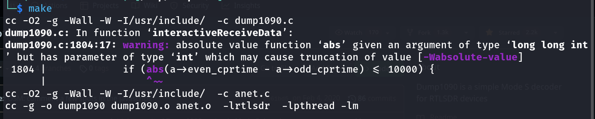
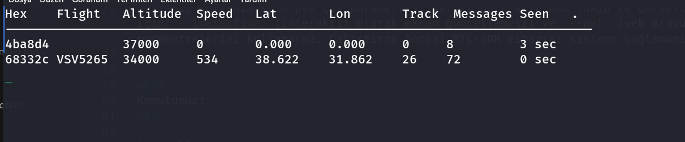
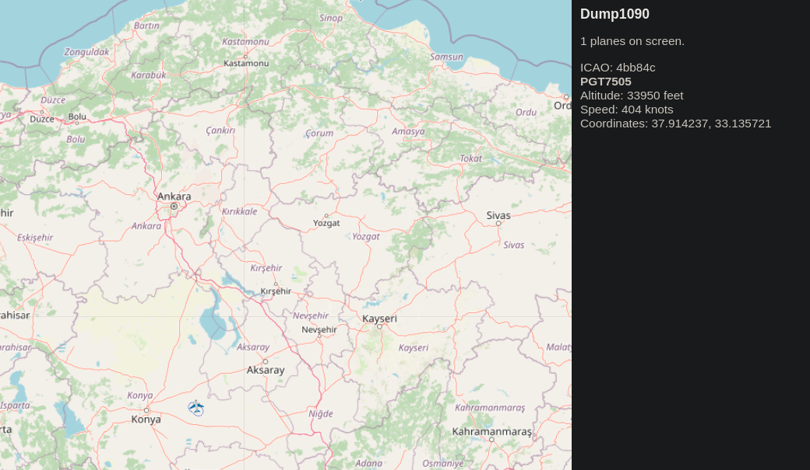

<p> 

# ADS-B nedir & ADS-B sinyallerinin gözlemlenmesi

<br>

ADS-B hava tarfiği izleme ve iletişiminde büyük rol oyanayan bir radar sistemidir. Günümüzdeki pekçok hava taşıtında bu sistem mevcuttur ve %90 ında zorunludur bulundurulması. Bu sistem sayesinde uçaklardaki GPS alıcıları ile alınan konum verileri diğer sensörlerden gelen ek verler eklenerek yayınlanır bu yayınları diğer uçaklar ve gözlemci yer istasyonu veya 3.kişiler alıp dinleyebilir. 


<br>

## Spektrum görüntüsü:
<br>

<br>
Özellikle düşük sinyal kalitesi veya kötü antenler ile dinleme durumlarında bu spektrum dmr spektrumu gibi görünebilir ve dmr için olan araçları şaşırtabilir dikkat edilmesi gerekiyor.


## Çalışma frekansı ve Tanımı

ADS-B standart olarak 1090mhz de çalışmaktadır duruma bağlı olarak 0.5-1.0mhz arası kaymalar olabilir. [ADS-B Sigwiki adresi](https://www.sigidwiki.com/wiki/Automatic_Dependent_Surveillance-Broadcast_(ADS-B)). Açılımıda şu şekildedir:
<br>
Automatic: Uçuş ekibinin herhangi bir aksiyon almasına gerek yoktur. <br>
Dependent: Uçağın navigasyon sistemlerinden gelen verilere bağımlıdır. <br>
Surveillance: Uçağın çeşitli bilgilerini talep eden tesislere veri sağlaması. <br>
Broadcast: Verilerin herhangi bir talep veya sorgulama (solicitation/interrogation) olmadan otomatik iletilmesi. <br>
<br>

Flightradar24 gibi servisler dünya çapında pekçok alıcı ve anten ile senkronize bir sistem kurarak çok geniş kapsamlı uçak trafiği haritaları sağlamaktadır ads-b gerçekten hava trafiği kontrolü ve güvenliği açısından önemlidir.
<br>

## Anten Seçimi:

<br>
Açık konuşmak gerekirse ADS-B için çok pahalı antenlere gerek yok 250tl ye aldığım gsm antenine oyuncak araba anteni eklemesi yapmıştım onla bile 60km lik bi yarıçap alıyorum apartmanın 4. katından.
<br>


## Dinleme ve Sinyallerin anlaşılır hale getirilmesi 

<br>

Bu işlem için `dump1090` adlı bir araç kullanacaz bu araç sayesinde basitçe decoding ve görselleştirme işlemlerini yapabiliriz. [dump1090 resmi github sayfası](https://github.com/antirez/dump1090) , kurulumlara başlayalım haydi.

<br>

```shell
# aracımız C ile yazıldığı için derleyicimizi kuralım
sudo apt install gcc -y

# otomatik derleme işlemi için make aracımız
sudo apt install make -y

# GitHub reposunu çekmek için git aracımızı kuralım 
sudo apt install git -y

# Repomuzu çekelim 
git clone https://github.com/antirez/dump1090.git

# Çekilen repo klasörüne gidelim 
cd dump1090
```


<br>

Şimdi derleme ve kullanım kısmına gelelim. Derlemek için `dump1090` klasörü içinde `make` komutu çalıştırmak yeterlidir.

<br>



<br>

Görüldüğü gibi ek bağımlılığı vs yoktur direk derlendi ekranda görülen kısımlar derleyicinin kod için önerileridir hatal değildir. Şimdi o klasör içerisinde `dump1090` şeklind eyeşil çalıştırılabilir bir dosya çıkacaktır. <br>
Gelişmiş kullanım için pek çok parametresi vardır bu aracın ama takip ve görselleştirme işlemi için `--inetactive` (interaktif olarak ekran güncellemesi) ve `--net` (web arayüzü) parametrelerini kullanacaz. Çalıştırma öncesi RTL-SDR cihazını sisteme bağlamamız gereklidir.


<br>
Komutumuz: 
<br>

```shell
./dump1090 --net --interactive
```


<br>



<br>

Görüldüğü gibi ekranda: <br>
- HEX (uçağın ICAD transponder kimliği ) 
- Flight (Kuyruk Tescil Numarasının kısa hali)
- Altitude (Deniz seviyesinde fit olarak yüksekliği)
- Lat: Uçağın enlemi, derece cinsinden ve ondalık kesir ile.
- Lon: Uçağın boylamı, derece cinsinden ve ondalık kesir ile.
- Track: Uçağın rotası, açı cinsinden.
- Messages Seen: Uçaktan alınan ADS-B mesajlarının sayısı.


<br>

Şimdi harita üzerinden takip edelim tarayıcımızdan  `http://localhost:8080/` adresine girelim dump1090 aktifken verdiğimiz `--net` parametresi sayesinde haritadan gözlemleyebiliriz.

<br>



<br>

Şekildeki gibi takip edebiliriz programdan çıkmak için CTRL+C yapmak yeterlidir. Bu derslik bu kadar.


</p>