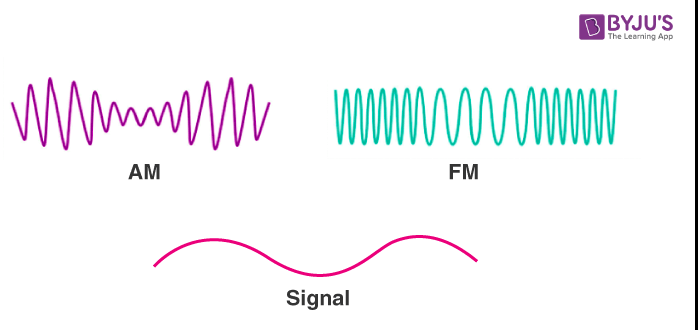

# AM (Amplitude Modulation) | Genlik Modülasyonu

Bir taşıyıcı sinyaling genliğinin bir bilgi sinyali ile değiştirilmesi sonucu elde edilir bu işleme modulasyon adı verilmektedir.

## Taşıyıcı Sinyal:
Veriyi taşıyacak olan sinyaldir bu sinyal üzerine bilgi eklenir.

## Bilgi sinyali:
Taşınacak olan veriyi içeren bir sinyaldir örneğin müzik yayını.

## Modülasyon:
Bu iki sinyal module edilerek birleştirilir ve iletişime hazır hale gelir 

## Demodülasyon:
Bilgi sinyali tekrardan taşıyıcı sinyalden çıkartılarak veri elde edilir.

# Örnek:

