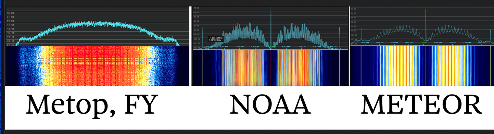
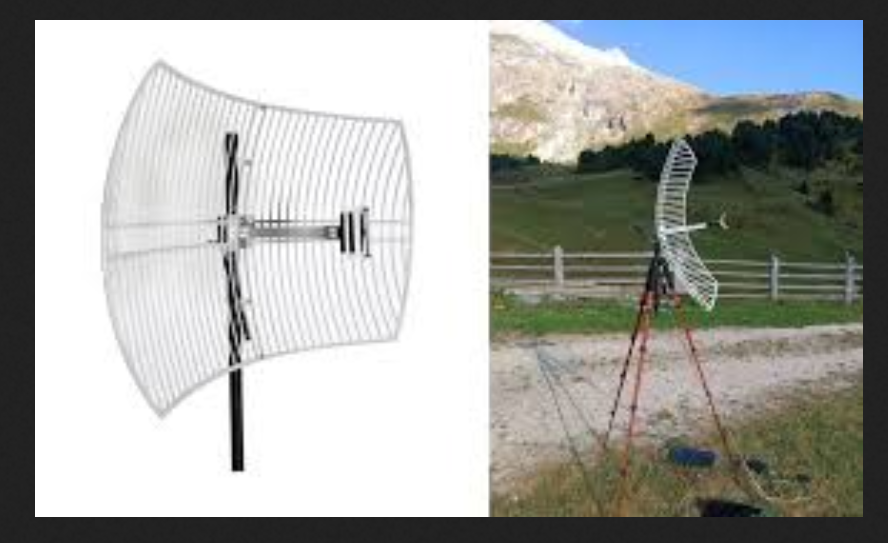

# Hight Resulation Picture Transfer | Yüksek Çözünürlüklü Resim Transferi

Hava durumu uydularından elde edilen yüksek çözünürlüklü görüntülerin yeryüzüne iletilmesini sağlayan sinyal tipdir. Rus hava durumu uyduları `Meteor` Amerika Ululas Hava dariresi `NOAA` uyduları Çin `Fengyun` uyduları gibi pek çok uydu bu sinyal tipini kullanmaktadır.

Bant genişliği standart olarak `3mhz` olsada `AHRPT` gibi daha farklı versiyonlarında değişkenlik gösterebilir.

Frekans aralığı `1670-1710mhz` aralığında yani yüksek frekanslı bir yayındır bu sayede yüksek miktarda veri sağlayabilir.

Çözünürlük olarak bir casus uydu kadar olamasada 1.1km/pixel oranında hava durumu ve çevre bilgisi sağlaması için gayet yeterli bir çözünürlüğü bulunmaktadır.

## Bazı hava durumu uydularının HRPT spektrumu:

 

Görüldüğü üzere farklı hava durumu uydularının farklı `HRPT` spektrumları vardır.

## Kullanılacak Anten Tipi:

 

Yüksek frekanslı bir yayın olması nedeniyle genel olarak çanak anten tarzında sinyali merkeze toplayan antenler kullanılmaktadır. Biraz maaliyetli bir iş maalesef.

## Demodüle Edilmesi İşlemi:

HRPT Halka açık olan uydulardan gene halka açık şekilde şifresiz yayın yaptığı için doğru donanım ve uydu açısı ile sinyali kaydedip demodüle edebilirsiniz bunlardan en basit araçlardan birisi `satdump` aracıdır.

 
<a href="https://github.com/SatDump/SatDump">SatDump GitHub Linki</a>

