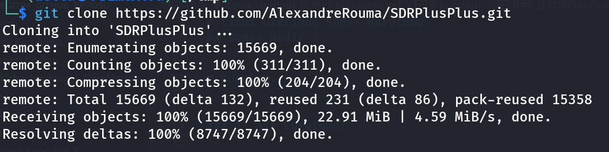
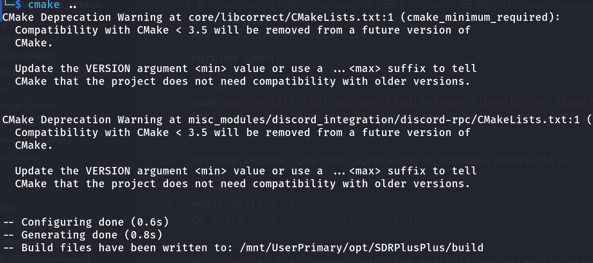
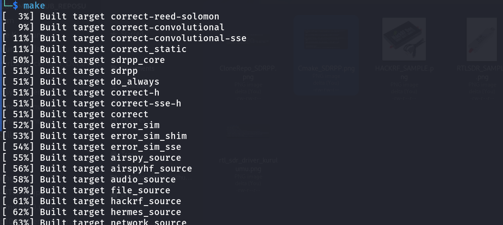
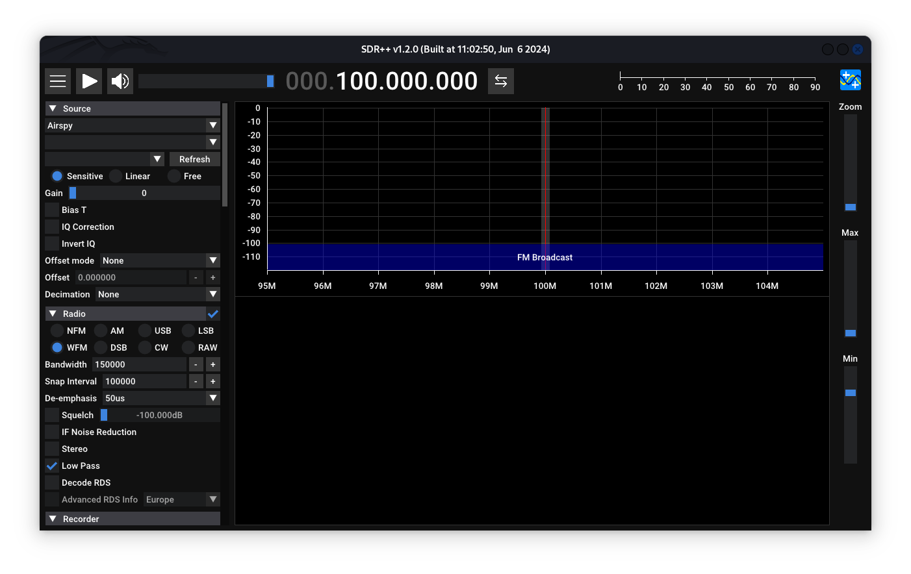

# Linux Üzerinde SDR++ Kurulumu 


## SDR++ Nedir ?

SDR++ Çapraz platform olarak sistemlerimizde `RX` yani sinyal alımı yapmamızı sağlayan bir yazılımdır. Oldukça modern bir arayüz ve geniş cihaz yelpazesi ile bu alandaki herkesin elinin altında bulunması gerekli bence.


# Kurulum:


### 1) git kurulumu:

Sistemimiz üzerinde hali hazırda `git` yok ise kuralım:

```shell
sudo apt update # repoları güncelle 

sudo apt install -y git # git'i kur
```

### 2) SDRPlusPlus GitHub Reposunu Çekelim:

Resmi repo adresi -> <a href="https://github.com/AlexandreRouma/SDRPlusPlus"> Tıkla </a>

```shell
# git ile repo'yu diskimize alalım
git clone https://github.com/AlexandreRouma/SDRPlusPlus.git

# repo klasörü içerisine girelim
cd SDRPlusPlus
```


### 3) Derlemeye başlayalım:

Derleme işlemine başlamadan önce bazı gerekli paketleri kurmamız gerek bunlar.

| paket | amacı |
|-------|-------|
| libfftw3-dev | FFT Dönüşümleri için matematiksel bir kütüpahne |
| libglfw3-dev | OpenGL için |
| libvolk2-dev | GNU Radyonun performansını arttırmak için |
| libzstd-dev  | Zstandart sıkıştırma kütüphanesi | 
| libairspyhf-dev | airspy donanımı için |
| libairspy-dev | airspy donanımı için |
| libiio-dev | fiziksel kartla iletişim için I/O |
| libad9361-dev | RF geliştirme kütüphanesi |
| librtaudio-dev | Ses giriş çıkışı içindir |
| libhackrf-dev | HackRF donanımı için |
| librtlsdr-dev | RTL-SDR donanımı için |
| cmake         | Make dosyamızı oluşturmak için |
| make          | Derleme yapmak için 
| g++           | C++ derleyicisi
|---------------|-----------------------|


NOT: `libvolk2-dev` paketi repo'da yok ise `libvolk1-dev` paketini kullanabilirsiniz.

Kurulum komutu:

```shell
sudo apt install libfftw3-dev libglfw3-dev libvolk2-dev libairspy-dev libzstd-dev libairspyhf-dev libiio-dev libad9361-dev librtaudio-dev libhackrf-dev librtlsdr-dev make cmake g++
```

Derleme yapmak için repo içerisinde klasörümüü oluşturalım.

```shell
mkdir build # klasörü oluştur 
cd build    # klasörün içerisine gir
```

NOT: `build` ismi zorunlu bir isim değildir ama anlaşılır olmasını sağlar.

Derleme için `Makefile` oluşturalım.

```shell
cmake .. 
```

Eğer herhangi bir paket eksiğimiz yok ise bu aşşağıdaki gibi bir çıktı sizi karşılar.




Şimdi asıl komut olan `make` komutumuzu çalıştırıp derlenmesini bekleyelim.


```shell
make # bu kadar 
```




İşlem bitince bulunduğumuz klasör içerisinde `executable` yani çalıştırmaya hazır bir dosya oluşacak ama direk çalıştırmak bu program için uygun değil bir uygulama olarak yüklemek istiyoruz bu nedenle sisteme indirmesini başlatalım 

```shell
make install
```

Bu işlem tamamlandıktan birkaç saniye sonra uygulama menüsü içerisinde SDR++ yerini alacaktır.


Arayüzü aşşağıdaki gibi olacaktır çok farklı olmaz genelde:





