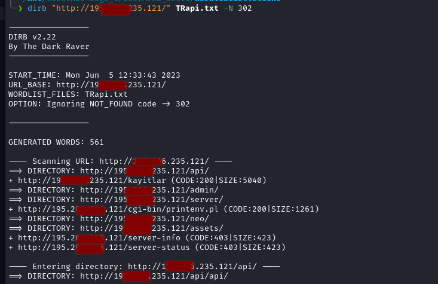
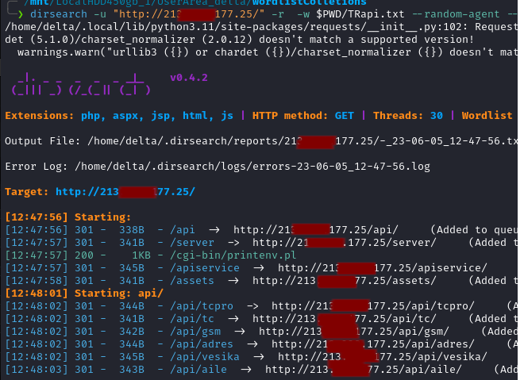
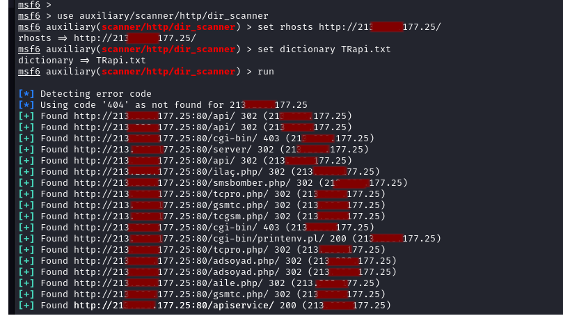

<style> 
.std_metin{
    font-size: 20px;
}
</style>


# Web dizin taraması/keşfi nedir?

<p class="std_metin" >Web dizin taraması belli bir ip adresindeki veya domain üzerindeki web sitesinin kök dizini altındaki dosyaların ve klasörlerin tespitidir. <br> </p>

# Bunu neden yaparız?
<p class="std_metin" >Bunu yapma nedenimiz web sitelerinin & sunucularının ön tanımlı ayar dosyaları, özel kullanıcı dosyaarını bunların yanı sıra gerçek hayatta denk gelebileceğimiz 
yedekleme dosyaları, sql dosyaları, .htaccess dosyası ve diğer gizli dizin içeriklerini bulma imkanı sağlamaktadır.</p>

# ilgili araçlar:
* <p class="std_metin"> dirb | Basit kullanışlı ama özel ayarları vermesi zor.</p>
* <p class="std_metin"> dirsearch | Birazdaha komplike , basit ,ayar vermesi kolay.</p>
* <p class="std_metin"> Metasploit | Temel seviyede denebilir pek özel ayarı yok.</p>


<br>

## 1) Dirb:
<hr>

<p class="std_metin">dirb küçük ve başarılı bir dizin tarama aracıdır ama özel ayarlar vermesi birz zor bir araçtur <br>
mesela yok sayılacak http durum kodlarını vs vermek çıktıyı okuması biraz sıkıntılıdır ama baya etkili bir araçtır ve python ile yazılmıştır.. <br>

| Parametre | Parametrenin anlamı |
|-----------|---------------------|
| -a       | özel user agent eklememizi sağlar |
| -c       | cookie değeri eklememizi sağlar |
| -H       | özel HTTP headeri eklememizi sağlar |
| -N       | yok sayılacak HTTP durum kodunu bekşrtmemizi sağlar |
| -o       | çıktıyı dosyaya kaydetmemizi sağlar |
| -p       | proxy eklememizi sağlar proxy_ip:proxy_port |
| -P       | proxy kimlik doğrulama bilgisi eklememizi sağlar proxy_username:proxy_pass |
| -r       | recursive (her dizini ayrı ayrı tarama) scan'i engelle |
| -R       | her dizin için recursive scan özelliğini kullanıcıya sor |
| -S       | slient mode, terminalin altında sürekli denenene sözcükleri göstermez |
| -t       | url sonlrına "/" ı zorlamaz |
| -u       | HTTP kimlik doğrulama bilgileri vermemizi sağlar username:pass" |
| -w       | hata mesajları için durma, bekleme demek |
| -X       | her karakterin sonuna eklenecek uzantıyı belirtmemizi sağlar |
| -x       | her karakterin sonuna eklenecek uzantıları içeren listeyi vermemizi sağlar |
| -z       | her istek arasına milisaniye cinsinden bekleme süresi eklememizi sağlar |

<br>
<hr>

```bash

    # keni wordlisti ile tarama yapar 
    dirb "http://127.0.0.1"

    # ek wordlis tile tarama 
    dirb "http://127.0.0.1" gelişmiş_wordlist.txt 

    # 'firefox 12.0.1 windows' user agenti ile '/tmp/wordlist.txt' wordlisti ile 127.0.0.1:9150 proxy si
    # uzerinden tarama yapar 
    dirb "http://127.0.0.1" -a "Firfox 12.0.1 windows" /tmp/wordlist.txt -p 127.0.0.1:9150  

    # Cookie ekleyerek tarama örneği 
    dirb "http://127.0.0.1" -c "cookie1:deger1; cookie2:deger2; cookie3:deger3"

    # url deki özel bir adrein taranması 
    dirb "https://127.0.0.1/secretAdmin/" 

```
</p><br>


<br>

## 2) Dirsearch:
<hr>





<p class="std_metin">dirsearch dirb den ve metasploit'den daha gelişmiş bir dizin taraması sağlar bize hem durum kodlarını yönetmede hem çıktı yönetme konusunda, hem cookie ile CloudFlare üzerinde tarama yapmamızı sağlar bu sayede hem dirb'i hemde msf'i gerie bırakarak en sevdiğim dizin tarama aracı olarak katagorilendirilebilir python dili ile yazılmıştır.

| Parametre | Parametrenin anlamı | örnek kullanım |
|-----------|---------------------|-----------------|
| -u        | hedef url yi vermemizi sağlar ZORUNLU bir parametredir. | -u "http://localhost.com" | 
| -l        | url listesi varsa elimizde dosya olarak vermemizi sağlar. | -l scanListesi.txt |
| -e        | her adresin sonuna uzantı eklememizi sağlar. | -e php,jsp |
| -X & --eclude-extensions | belilrtilen uzantıyı sonuçlarda göstermez hariç tutar | -X bak,backup,json |
| -w        | özel wordlist vermemizi sağlar ama wordlisstin tam dosya yolunu vermek gereklidir | -w /home/user/YedekListesi.txt |
| -t & --threads | aynı anda kaç istek yapılacağını belirtir yüksek istekler dos olarak algılanabilir | --threads 2 | 
| -r & --recursive | her dizinin içinin tekrar taranmasını sağlar | -r (parametre almaz) | 
| -x & --exclude-status | belirli http durum kodlarını çıktıda göstermez hariç tutar | --exclude-status 404,503 |
| --exclude-size | belirli bir dosya boyutunu çıktıda göstermez hariç tutuar |  --exclude-size 42B (42 BAYT) |
| --exclude-texts | belirtilen metni içeresen sayfaları çıktıda göstermez hariç tutar | --exclude-texts "access denied" |
| --no-color    | renkleri sevmeyenler için çıktının renksiz siyah-beyaz olmasını sağlar | --no-color (parametre almaz)
| -m & --http-method | POST, GET, HEAD gibi isteklerin hangi methotlarla yapılacağını belirler ön tanımlı olarak GET dir | -m POST | 
| -d & --data | POST olarak gönderilecek özel datayı belirtmemizi sağlar | --data "username=hacer&password=hacer123" | 
| -H & --header | HTTP headerlarını belirtmemizi sağlar | -H "User-Agent: Win1987 firefox 3" |
| --random-agent | isteklerin random user-agent ile yapılmasını sağlar | --random-agent (parametre almaz | 
| --header-list | headerleri içeren dosya vermemizi sağlar | --header-list /home/user/headerList.txt | 
| --user-agent | özel user agent vermemizi sağlar | --user-agent "Google Chrome Win64" |
| --cookie  | özel cookie vermemizi sağlar |  --cookie "koki1:değer1; koki2:değer2; koki3:değer3 " |
| --timeout | bağlantı zaman aşımı süresini belirler | --timeout 20s |
| -s & --delay | istekler arasına nekadar saniye zaman konulcağını belirtir | --delay 2 |
| --proxy | proxy eklememizi sağlar | --proxy "socks5://127.0.0.1:9150" | 
| -o | çıktıyı dosyaya kaydetmemizi sağlar | -o çıktılar.txt |
| --format | çıktı formatını belirlemeyi sağlar | --format json |

<hr>
<br>

```bash


    # en temel tarama örneği 
    dirsearch -u "google.com" 

    # özel bir wordlist vererek erişim engeli olan ve notFound veren sayfaları hariç 
    # tutarak tarama yapalım
    dirsearch -u "127.0.0.1" -w /home/user/liste.txt --exclude-status 403,404 


```


</p>

<br>

## 3) Msfconsole:
<hr>
 


<p class="std_metin">Metasploit-Framework çok geniş çaplı bir araçtır bu nedenle içersinde herzaman işimize yaricak modüller vardır. Dizin taraması için 'auxiliary' yani keşif modülleri altındaki bir modülü kullanacaz. Kullanacağımız modülün adı auxiliary/scanner/dir_scanner 'i kullanacaz. Ama şunu unutmamak lazım dirsearch ve dirb e göre çok az özelliğe sahip bir tarama aracıdır 
bu nedenle beklentiler çok yüksek tutmamak lazım ama genede kullanılabilir ve arada kullanacağız. 

```bash

    # msfkonsolu başlatalım 
    msfconsole 

    # kullanılacak modülü belirtelim 
    [msf]> use auxiliary/scanner/dir_scanner

    # show options ile ayarları görelim 
    [msf]> set rhost "http://localhost.com"

    # özel wordlist istiyorsak wordlisti belirtioz 
    [msf]> set DICTIONARY /home/user/dizinListesi.txt 

    # Ve tarama işlemini başlatalım 
    [msf]> run

```


</p>

## Özel wordlist hazırlanması:
<hr>

<p class="std_metin">
Yukarıda işlediğimiz bütün araçlar özel wordlit kullanma desteği sunmaktadır bu nedenle hedefler üzerinde etkiyi gerçekten çok fazla arttıran bir etmendir bu wordlistler satırlar halindeki metin dosyalarıdır belli kuralları hariç düz metindir örnek olarak 
illegal web siteleri için hazırlamış olduğum kendi wordlistimden bir kesit var aşşağıda.


</p>
<br>

<br>
<p class="std_metin">Bu şekildedir burada dikkat edilecek tek nokta klasör isimleridir klasörler "gizlibelge/" gibi yazılılarsa 
dosya olarak algılanacaktır bu nedenle iç yinelemeli taramada hariç tutulur buda çok sayıda dosyanın bulunamaması anlamına gelir 
bu nedenle "gizlibelge" gibi direk ismi ile yazacaz ki klasör olarak algilanabilsin.
</p>

<h2><B><a href="https://github.com/TheKoba-dev/TurkceWebDizinWordlisti">Resimdeki Wordlistin GitHub adresi için tıklyınız.</a> </B></h2>

<br>

## Ek notlarımız:
<hr>

<p class="std_metin">>> Her taramada random'da olsa User-Agent eklemeniz kesinlikle önemlidir bence. 
Nedeni ise araçların ön tanımlu user agentleri vardır mesela dirsearch'ınki "dirsearch" dır bunlar otomatik karaliste çiçinde 
olabilirler mesela .htaccess e eklenerek direk istekler iptal edilebilir buna önlem olarak User-Agent vermek önemlidir. <br><br>
>> Özellikle CloudFlare gibi bot koruma sistemlerinin arkasında olan web sitelerini tararken taramanın çalışması için cookie ve user agent eklenmesi gerekir ama random user-agent olmaz cookie alındığı zamanki user-agent olması gerek bu sayede düşük threads 
ve araya zaman ekleyerek CloudFlare'in taramayı engellemesini engelleyebiliriz bu önemli bir husustur.


https://t.me/safaksiz_egiim için hazırlanmıştır.
Hazırlanma Tarihi: 06.05.2023.

</p>