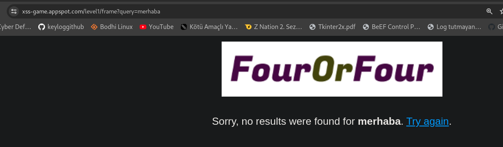

# XSS | Cross-Site Scripting 

Türkçe Anlamı `Çapraz Site Script Enjeksiyonu` demektir, Türkçe anlamından pek birşey anlaşılmasada önemli bir konudur. Bu güvenlik açığının saldırganlara sağlamakta olduğu şey kullanıcıların tarayıcılarında kod çalıştırabilmek ve bu sayede tarayıcıların pek çok gelişmiş özelliğini kötü amaçlı olarak kullanılabilmesidir.

Çok basit olarak bakacak olursak mesela belediyenizin web sitesinde XSS zafiyeti mecvut ve bir saldırgan bunu fark ederek bunu kullanmak istedi. Belediyenin web sitesine kötü amaçlı bir `JavaScript` kodu ekledi bu kod çalışmak istediği zaman belediye.bel.tr nin kendisine ait bir özellik gibi size görünür buda pek çok kullanıcının buna inanmasına neden olur. 

Yani sözün özü XSS bir siteye başka bir siteden `JavaScript` kodu eklenmesine denir.

# XSS Kategorileri:
<h3> Reflected XSS:</h3>    Bu tip XSS de kullanıcıdan gelen veriler direk olarak filtrelenmeden web sayfasına eklenir ise olur.
mesela örnek olarak aşşağıdaki resme bakalım.

Bu resme bakıldığı zaman `frame?query=merhaba` query olarak verilen "merhaba" metninin direk olarak ekrana verilmesi var
eğer bu metin herhangi bir filrelemeye sokulmuyor ise saldırganlar buraya `JavaScript` kodu ekleyip sayfanın direk olarak 
bu kodu kullanıcıya iletmesine neden olur. Bu gibi kullanıcının sağladığı veriler üzerinden yapılan XSS'e `Reflected` XSS denmektedir.

<h3>Sotred XSS </h3>    Bu tip XSS saldırılarında zararlı kod <B>kullanıcı tarafından sağlanmaz</B> saldırgan daha öncesinde bu zararlı kodu web sayfasına girmiş ve buda kaydedilen içerikle beraber veritabanı içerisine taşınmıştır. Bu sayede web sitesinin o kısmına giren her kullanıcı otomatik olarak bu XSS den etkilenir.

<h3>DOM Based XSS</h3>  Bu tür XSS web sayfalarının dinamik olarak değişen `Document Object Model` üzerinde çalışan XSS tipidir. Peki DOM nedir, Dom bir web sayfasındaki HTML'e `JavaScript` gibi diller ile erişerek müdehale edilmesini sağlar. Bu saldırı tipi genel olarak Web sayfalarındaki Dinamik olarak işlenen noktaları hedef almaktadır.

 

# XSS'in riskleri

XSS sayesinde kullanıcıların tarayıcılarında çalıştırılan `JavaScript` vs kodlarının sonucunda kullanıcıdan güvenilir olan bir web sitesi üzerinden özel verilerinin çalınması, `Beef` gibi araçkar ile pek çok ek saldırı gerçekleştirilebilir. Kamera açma, yönlendirme gibi tarayıcının izin vermiş olduğu pek çok tehlikeli özellik bulunmaktadır.

# XSS Tespiti:

XSS Kullanıcı girdilerinin doğru filtrelenmemesi sonucunda oluşmaktadır bu nedenle kontrol edilecek noktalar kullanıcılardan girilen verilerin gösterilmiş olduğu alanlardır. Bunlar arasında Arama çubukları, İsim girişi, Blog'lar için metin girişleri gibi pek çok örnek verilebilir.

