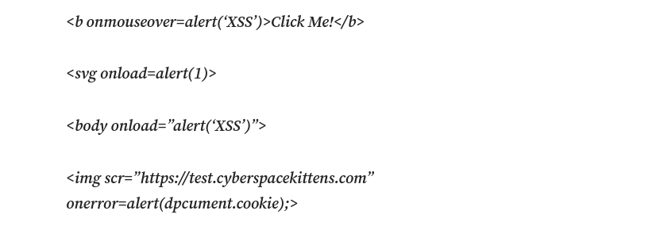

# XSS İçin Temel JavaScript ve HTML


Bildiğimiz üzere XSS tarayıcılar üzerinde çalışan script dilleri ile aktif olmaktadır. XSS i anlamak ve kullanmak için çok temel'de olsa JavaScript ve HTML bilmek gerekir.


```html 

<!-- Belge Tipi -->
<!DOCTYPE html>

<!-- Belge dili -->>
<html lang="tr">

<head>
    <!-- Meta bilgiler --> 
    <meta charset="UTF-8">
    <meta name="viewport" content="width=device-width, initial-scale=1.0">

    <!-- sayfa başlığı --> 
    <title>> Title </title>

    <!-- CSS içe aktarma --> 
    <link rel="stylesheet" tpype="text/css" href="a.css"  >

    <script> 
        <!-- # Script Kodları Bu Noktaya Yzılır # -->
    </script>

</head>
<body>

    <!-- kalan kısımlar -->

</body>
</html>        

```

<br>

Yukarıda Görüldüğü gibi `HTML` de herşey taglar arasına yazılmaktadır ya tek bir tag içinde yazarsını yada tag'ı açıp arasına yazıp kapatırsınız. `JavaScript` gibi script'ler de aynı şekilde `<scriopt> </script>` tagları arasına yazılmaktadır. Filtreleme yapılmadan `HTML` içerisine direk olarak eklenen girdilerde bu tagları kullanarak sanki orjinal kod içerisinde varmış gibi tarayıcıların çalıştırmasını sağlayabiliriz.

### En çok kullanılan en basit örnek: 

```html 
<script> alert(1) </script>
```
<br>

Bu basit kod tarayıcıda küçük bir alarm penceresi açar ve içerisinde 1 yazar bu yöntem en basit XSS deneme örneklerinden birisidir. 


## CloudFlare ve Diğer WAF lar ile XSS:

<br>

CloudFlare gibi `CDN` (içerik dağıtım ağı) ve bazı alanlarda web güvenliği sağlayan sağlayıcılar `XSS` gibi zararlı trafikleri engellemeye yönelik özellikleri bulunur bu özellikleri bypass etmek için tabili farklı yöntemler vardır bunlardan en basiti `Obfuscating` yani kod karmaşıklaştırmadır kod içerisine eklenen normal görünen ama sistemin yapıyı anlamasını engelleyen boş kodlar eklemek, farklı karakter kodlamaları ile kodu yazmak, farklı tetiklenme mekanizmaları ile kodu yazmak gibi yöntemler içermektedir.


### Örnek birkaç kod



<br>

Yukarıdaki kodlarda yukarıda vermiş olduğumuz örnekler gibi `JavaScript` çalıştırmaktadır ama farkları tetiklenme ve biçimleri sistemlerin filtreleme mekanizmalarını atlatmalarını sağlar.


